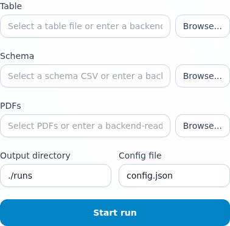
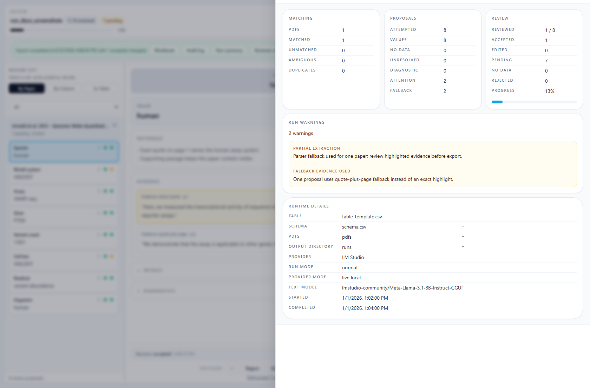

# extract-structured-info-from-papers

A local-first paper-to-table review app. Ingest scientific PDFs and a structured spreadsheet, generate evidence-backed cell proposals, review them in a browser UI, and export audited XLSX updates.

---

## Architecture

- **Backend:** Python 3.11+, FastAPI, Pydantic v2
- **Frontend:** React + TypeScript + Vite + Tailwind CSS + PDF.js
- **Storage:** Filesystem artifact bundles (JSON files), no database
- **Default provider:** LM Studio (local), via `http://localhost:1234`

---

## Prerequisites

- Python 3.11 or later
- Node.js 18 or later and npm
- [LM Studio](https://lmstudio.ai/) running locally with a model loaded (required for actual proposal generation)

---

## Install and start

### 1. Clone and install backend dependencies

```bash
git clone https://github.com/jjfroehlich/extract-structured-info-from-papers.git
cd extract-structured-info-from-papers
pip install -e ./backend
```

> **Note:** This installs all required backend packages including `docling` (the PDF parser) and `pypdfium2`. `docling` downloads ML models on first use and may take a minute.

### 2. Install frontend dependencies

```bash
cd frontend
npm install
cd ..
```

### 3. Start the backend

```bash
python -m uvicorn backend.app.main:app --reload --port 8000
```

The API will be available at `http://localhost:8000`.

### 4. Start the frontend

```bash
cd frontend
npm run dev
```

Open `http://localhost:5173` in your browser.

---

## UI walkthrough

The browser UI is the primary operator surface for launch, review, and export.

### Run setup



The config **Browse...** control prefills a file name for convenience. Optional override pickers can also stage selected files into backend-readable handles for a run.

### Highlighted-evidence review


The review workspace keeps dense grouped triage, proposal detail, and highlighted PDF evidence visible at the same time. Blue overlays mean exact quote highlights; dashed orange overlays mean approximate regions; the amber text panel means quote-plus-page fallback.

### Manual export and diagnostics artifacts



Export is always explicit. The workbook and JSON download links only appear after the reviewer clicks **Export reviewed workbook**.

For a compact screenshot-backed operator guide, see [`docs/operator-workflow.md`](docs/operator-workflow.md).

---

## Configuration

All run parameters are controlled by a JSON config file. Copy the example to get started:

```bash
cp config.example.json config.json
# Edit config.json with your paths and model settings
```

The canonical provider token is `lm_studio`. Tokens such as `lmstudio`, `LMStudio`, or `openai` will produce a clear validation error at run start.

### Key config fields

| Field | Description |
|---|---|
| `table_path` | Path to spreadsheet (XLSX or CSV) |
| `schema_path` | Path to schema CSV (`column_name`, `description`, optional `field_type`, optional `allowed_values`) |
| `pdf_dir` | Directory containing PDF files |
| `output_dir` | Where run artifacts are stored (default: `./runs`) |
| `verify_mode` | If `true`, already-filled cells are also extraction targets |
| `eval_mode` | If `true`, the app stages a masked working copy for leakage-safe eval runs |
| `provider.token` | Must be `"lm_studio"` |
| `provider.base_url` | LM Studio API base URL (default: `http://localhost:1234`) |
| `provider.text_model.model_id` | ID of the text model loaded in LM Studio |
| `provider.vision_model.model_id` | ID of the vision model (optional) |
| `figure_review.enabled` | Enables text-guided figure review as supplemental evidence (global, not schema-per-column) |
| `retrieval.top_k` | Focused retrieval passage count for the first pass (default: `6`) |
| `retrieval.recall_rescue_enabled` | Retry `unclear` results with deterministic expanded retrieval (default: `true`) |
| `retrieval.whole_document_mode` | Opt-in whole-document rescue context for short parsed papers (default: `false`) |

### Schema-first extraction guidance

Schema-first empty-table operation is the normal/default workflow. You do **not** need prefilled examples in the workbook for extraction to work.

When `field_type` is provided in the schema, extraction honors it without requiring prefilled table examples. `allowed_values` are only valid for `categorical` fields. Numeric fields preserve `exact`, `range`, or `approximate` answer forms internally.

Use schema descriptions to tell the reviewer-facing system what paper evidence should count:

- name the paper fact directly
- include units, scope, or disambiguators when the column name is short
- keep one extractable concept per column
- use `allowed_values` for categorical fields instead of relying on reviewer memory

Concrete schema snippet:

```csv
column_name,description,field_type,allowed_values
Species,Species used in the assay or model system.,categorical,"[""human"",""mouse"",""yeast""]"
Model system,Cell line or organism context used for the reported experiment.,text,
Number of Conditions,How many distinct experimental conditions were tested in the paper.,number,
Readout,Primary assay readout used to measure expression or activity.,categorical,"[""RNAseq"",""scRNAseq"",""FACS""]"
```

Supported optional field types are `text`, `number`, `categorical`, and `boolean`.

Numeric answer forms stay truthful to the paper:

- `5` → exact
- `5-7` → range
- `~5` → approximate
- values estimated from a graph should remain approximate rather than being rewritten as exact

### Text-guided vision strategy

Vision is not configured per schema column. The app decides when to use figure review from extraction evidence quality and paper context.

- figure shortlisting combines retrieved field text, caption relevance, explicit figure references (for example, `Fig. 2a`, `Figure 3B`), and nearby section context
- vision is triggered selectively when text is unclear, weak, contradictory, needs confirmation, or figure/graph extraction looks promising
- shortlist and trigger reasons are persisted with proposal/evidence artifacts for reviewer trust
- figure calls are bounded to a narrow shortlist; broad untargeted figure sweeps are avoided

The config file is the authoritative control surface for all run parameters. Path overrides entered in the browser UI apply to a single run only and do not change the config file.

### Verify mode vs Eval mode

- `verify_mode = true` compares proposals against already-filled cells inside the review workflow.
- `eval_mode = true` uses the completed table as gold input, snapshots it into the run bundle, creates an app-owned masked working copy for extraction, and records prompt/config/schema provenance for later scoring.
- `verify_mode = true` and `eval_mode = true` together are invalid and fail early with a clear config/readiness error.
- The masked working copy preserves structure and extraction-relevant content, but it is an internal artifact and does not promise workbook-formatting fidelity.

Eval mode is artifact emission for a separate scorer, not an in-app benchmark dashboard. The main app persists downstream scoring context in run and proposal artifacts, including:

- run mode truth (`run_mode: eval`)
- `prompt_version` or `prompt_hash`
- `config_hash` and `config.snapshot.json`
- `schema_hash`
- parser identity (`parser_identity`)
- gold table provenance (`source_reference`, `content_hash`, `snapshot_path`)
- masked working table provenance (`path`, `content_hash`)

---

## Primary workflow

### 1. Create a run

1. Open `http://localhost:5173` in the browser.
2. In the **Run** tab, enter the path to your config file (e.g. `config.json`). The config **Browse...** control is a local convenience for picking a file name; confirm or edit the backend-readable path before creating the run.
3. Optionally expand **optional path overrides** to override `table_path`, `schema_path`, or `pdf_dir` for this run.
4. For overrides, either type a backend-readable path or use **Stage... / Stage PDFs...** to upload picker-selected files into app-owned staged handles.
4. Click **Create Run**.

Run details and input summary artifacts include `resolved_inputs` so you can distinguish each input's logical source (config/path override/staged handle) from the backend runtime locator used during execution.

The run progresses through: `created → validating → running → completed` (or `completed_with_warnings` / `failed`). Select any run from the list to see stage progress, warnings, and error details.

Active runs refresh automatically. If live refresh fails, the Run tab shows an explicit stale-status warning so you do not mistake old state for current state. Active runs can be aborted from the Run detail surface.

A run reaches `completed_with_warnings` when it finished but encountered non-fatal issues (for example, matching ambiguity or fallback evidence quality warnings). The run is still reviewable and exportable.

Eval-mode runs also persist `inputs/gold_table*` and `inputs/masked_working_table*` snapshots plus hashes in `run.json`, `inputs/input_summary.json`, and proposal artifacts so a separate eval tool can score the run later.

### 2. Review proposals

When a run reaches `completed` or `completed_with_warnings`, the **Review** tab becomes active.

The review workspace has three panes:

- **Left — Proposal Queue:** Browse proposals grouped by paper or column. The queue defaults to **Pending** reviewable proposals so sequential review stays fast. Click a proposal to load it.
- **Center — Proposal Detail:** Shows the proposed value, rationale, evidence list, and row context. Click an evidence item to jump to it in the PDF viewer.
- **Right — Evidence Viewer:** Renders the source PDF with PDF.js. Blue overlays show exact highlights; dashed orange overlays show approximate regions. Explicit **Previous evidence** / **Next evidence** controls stay synchronized with the selected evidence item. A text fallback panel appears when exact highlighting is unavailable.

**Decision controls:**

| Button | Action |
|---|---|
| **Accept** | Accept the proposed value as-is |
| **Accept with Edit** | Accept with a corrected value |
| **No Data** | Confirm this cell has no data in this paper |
| **Reject** | Reject the proposal |

**Keyboard shortcuts:**

| Key | Action |
|---|---|
| `A` | Accept |
| `R` | Reject |
| `]` or `N` | Next proposal |
| `[` or `P` | Prev proposal |
| `Alt+N` | Next evidence |
| `Alt+P` | Prev evidence |
| `E` | Focus edit input |
| `?` | Show shortcut help |

After an explicit decision (accept, accept with edit, no data, reject), the workspace auto-advances to the next pending reviewable proposal when one exists.

The top review summary uses **actionable review counts** as the main progress headline and keeps broader attempted totals secondary. Parsing fallback, OCR fallback, duplicate-row conflicts, provider mode, and evidence fallback remain visible through the review summary and unresolved surfaces.

The **Unresolved** tab shows unmatched PDFs, ambiguous matches, and duplicate row conflicts for inspection.

### Verify mode

When `verify_mode` is `true`, the app also generates proposals for already-filled cells instead of treating them as protected by default.

- the review detail pane shows **Current** vs **Proposed** values
- accepted decisions can write reviewed updates for those already-filled cells into the explicit export
- reviewer summaries include those reviewed comparisons, but this MVP does **not** add an automated correctness score

### 3. Export

After completing review, trigger export from the **Review** tab with **Export reviewed workbook** (or via the API):

```bash
POST /api/runs/{run_id}/export?output_dir=./runs
```

Export is always explicit and manual. Run completion and review decisions never auto-export. Triggering export generates three files in `{run_id}/exports/`:

- `workbook_{timestamp}.xlsx` — updated XLSX with accepted changes and yellow cell highlighting
- `audit_log_{timestamp}.json` — decision log (row, column, old value, new value, timestamp)
- `diagnostics_{timestamp}.json` — matching failures, blocked proposals, unsupported-feature warnings

Only explicitly **accepted** (as-is or with edit) proposals are written to the workbook. Unreviewed, confirmed-no-data, and rejected proposals are excluded by construction.

Confirmed-no-data remains a review outcome only. It is visible in summaries and audit artifacts, but it never writes a value to the workbook.

### 4. Download

Use the download endpoints or the review UI download buttons that appear after an explicit export:

| Endpoint | Returns |
|---|---|
| `GET /api/runs/{run_id}/downloads/workbook` | Updated XLSX workbook |
| `GET /api/runs/{run_id}/downloads/audit-log` | Audit log JSON |
| `GET /api/runs/{run_id}/downloads/run-summary` | `run_summary.json` |
| `GET /api/runs/{run_id}/downloads/reviewer-summary` | `reviewer_summary.json` |

Download endpoints return 404 if the export has not been triggered yet.

---

## Evidence semantics

Evidence labels are intentional and reviewer-facing:

- **Direct quote** — exact page-text highlight
- **Approximate highlight** — region-level fallback when exact alignment fails
- **Quote + page** — text fallback when highlight geometry is unavailable
- **Inferred reasoning** / **Calculation** — support types shown separately from direct quotes
- **Figure evidence** — labeled separately when figure review is used

Figure-derived numeric answers keep honest value form semantics:

- graph estimate -> `approximate`
- graph interval -> `range`
- exact textual statement -> `exact`

The app does not silently collapse graph-derived approximate/range values into exact values.

Fallback evidence is still reviewable, but it is labeled as fallback instead of being presented as exact evidence.

---

## Export fidelity boundary

The exported workbook is **content-only**. The following are explicitly **not** preserved:

- Formulas (stripped; export contains values only)
- Conditional formatting
- Filters (auto-filter)
- Frozen panes
- Hidden rows or columns
- Merged cells
- Cell comments
- Named ranges
- Charts, shapes, and macros

When any of these features are detected in the source workbook, warnings are recorded in `diagnostics_{timestamp}.json` under `unsupported_workbook_features`. The export still proceeds; unsupported features are warned about and ignored rather than silently corrupted.

The exported XLSX always contains all rows and columns from the source workbook, with accepted-change cells highlighted in yellow. Other cells retain their original values.

---

## Run artifact layout

```
{output_dir}/{run_id}/
  run.json                        # Live run state (status, stage, counts)
  config.snapshot.json            # Frozen config used for this run
  inputs/
    input_summary.json            # Table/schema/PDF metadata
  proposals/
    proposals.jsonl              # Append-only proposal records
    proposal_index.json          # Proposal lookup metadata
  provider_mode.json             # Persisted provider/mode/readiness truth
  evidence/                       # Per-proposal evidence (JSON files)
  review/
    decisions.jsonl               # Append-only review decision log
  summaries/
    run_summary.json              # Final run summary
    reviewer_summary.json         # Reviewer outcome counts
  exports/
    workbook_{ts}.xlsx            # Updated workbook (after export triggered)
    audit_log_{ts}.json           # Decision audit log
    diagnostics_{ts}.json         # Diagnostics and warnings
  logs/                           # Diagnostic logs
```

---

## Provider requirements

LM Studio must be running and have a model loaded before starting a run. The app checks reachability at run start and fails early with a clear error if LM Studio is unreachable.

The canonical provider token is `lm_studio`. No other token is accepted.

Example model IDs (any compatible model may be used):
- Text: `lmstudio-community/Meta-Llama-3.1-8B-Instruct-GGUF`
- Vision: `lmstudio-community/llava-v1.6-mistral-7b-gguf` (optional)

If the provider is unavailable at startup (or the configured model IDs are not available), readiness fails and the run ends in `failed` with an explicit startup error.

Structured output behavior is negotiated per provider-model path:
- Preferred: `json_schema`
- Fallback: `json_object` (explicit degraded mode warning is recorded)
- Hard fail: neither structured mode is supported

Readiness and capability failures are classified separately in run artifacts and UI surfaces:
- Provider unreachable/unavailable
- Model unavailable/not loaded
- Structured-mode capability mismatch (no compatible structured mode)
- Negotiated `json_object` fallback (degraded but compatible)

---

## Provider, parsing, and fallback truth

- `lm_studio` is the canonical live provider token for the local-first path.
- The review summary surfaces provider mode directly so you can tell whether a run is `live local`, `live cloud`, `unavailable`, `disabled`, or `stub/demo`.
- If a run uses `json_object` fallback, a `provider_degraded` warning is emitted so degraded structured-output mode is explicit.
- Parsing fallback, OCR fallback, duplicate-row conflicts, and evidence fallback remain visible as warnings or badges instead of being hidden.
- Fallback evidence is never relabeled as exact evidence.
- If the configured live provider is unreachable at startup, the run fails during readiness rather than pretending to finish with warnings.

---

## Trustworthiness checklist

- [ ] Confirm the provider mode shown in the UI matches your intended local/cloud path.
- [ ] Read the evidence label before treating a proposal as directly supported.
- [ ] Review proposals before export; proposal presence is not proof.
- [ ] Trigger export explicitly instead of assuming run completion wrote a workbook.
- [ ] Keep the audit log and diagnostics JSON with the exported workbook.

---

## Testing

### Backend tests

```bash
python -m pytest tests/backend -v
```

### Frontend tests

```bash
cd frontend
npm run test -- --run
```

### Frontend lint + build

```bash
cd frontend
npm run lint && npm run build
```

### End-to-end tests (opt-in, auto-start deterministic local stack)

```bash
pip install -e ./backend[test]
python -m playwright install chromium
cd frontend && npm install && cd ..
python -m pytest tests/e2e -m e2e
```

This currently exercises the implemented Playwright slice for run-setup gating, picker staging/prefill truth, fast review, evidence cycling, explicit export, and screenshot capture.

### Refresh README screenshots

```bash
pip install -e ./backend[test]
python -m playwright install chromium
cd frontend && npm install && cd ..
python -m pytest tests/e2e/test_doc_screenshots.py -m e2e --capture-doc-screenshots
```

### Live LM Studio smoke test (opt-in)

```bash
LM_STUDIO_TEXT_MODEL=<model-id> PAPER_TABLE_SMOKE=1 python -m pytest tests/backend/test_smoke_lmstudio.py -v -m smoke
```

---

## Fixtures

Canonical test fixtures are in `tests/fixtures/`:

- `tests/fixtures/tables/literature_fixture.xlsx` — example workbook
- `tests/fixtures/tables/literature_fixture_schema.csv` — column schema
- `tests/fixtures/papers/paper_1.pdf` … `paper_4.pdf` — matched PDFs
- `tests/fixtures/papers/unmatched_1.pdf` — intentionally unmatched PDF

---

## Known MVP limitations

- **LM Studio must be running** at run start. The readiness check fails early with a clear error if unreachable.
- **Content-only export.** Formulas, conditional formatting, filters, frozen panes, merged cells, charts, and macros are not preserved. Changed cells are highlighted in yellow; other formatting is stripped.
- **Partial review is allowed.** Export may proceed with only a subset of proposals reviewed. Only explicitly accepted proposals are written.
- **PDF highlight coordinates** are shown when available. When not available, quote text is shown as a text fallback.
- **No in-place workbook patching.** The export always writes a new XLSX file; the source workbook is never modified.
- **Browser file pickers cannot provide native local paths.** For overrides, use staged handles (`Stage...` / `Stage PDFs...`) or type backend-readable paths explicitly.

---

## Development commands reference

| Command | What it does |
|---|---|
| `python -m uvicorn backend.app.main:app --reload` | Start backend (dev, auto-reload) |
| `cd frontend && npm run dev` | Start frontend dev server |
| `cd frontend && npm run build` | Build frontend for production |
| `cd frontend && npm run lint` | Run ESLint |
| `cd frontend && npm run test -- --run` | Run frontend unit tests |
| `python -m pytest tests/backend -v` | Run backend tests |
| `python -m pytest tests/e2e -m e2e` | Run Playwright e2e tests against the deterministic local demo stack |
| `python -m pytest tests/e2e/test_doc_screenshots.py -m e2e --capture-doc-screenshots` | Refresh the checked-in README screenshots |
