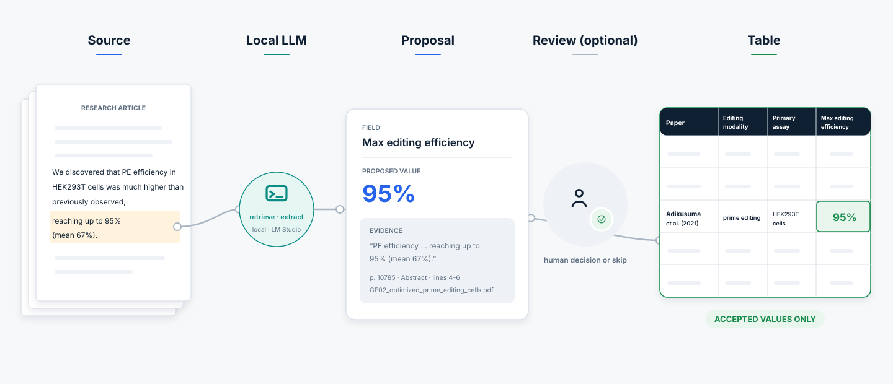
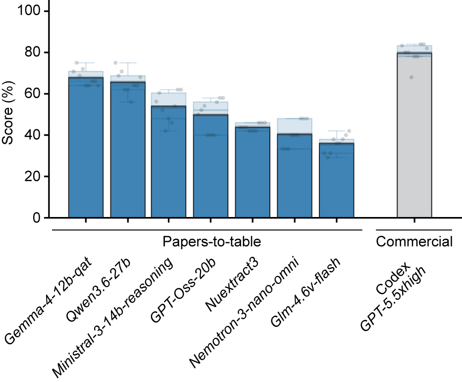
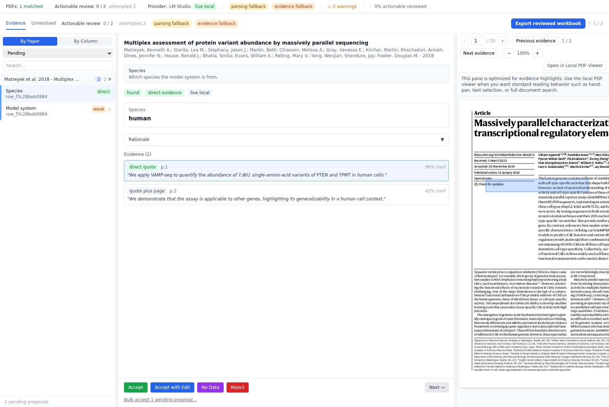
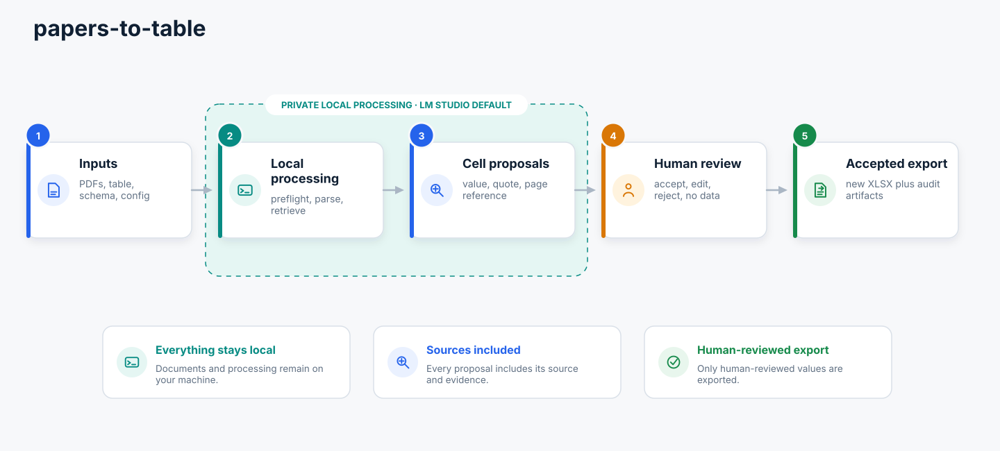

<p align="center">
  
</p>

## Purpose
Papers-to-table is an experimental system to extract information from scientific PDFs into structured tables, using large language models. It can extract technical parameters, descriptions of results, or claims made by the authors. It runs fully local, and includes an interface for human review, auditable source evidence, and tools for benchmarking and development.

<p align="center">
  
</p>

## Relevance
Commercial literature tools extract structured information into table formats, see for example [Google Labs Science](https://labs.google/science/), [Elicit](https://elicit.com/), or [Scite](https://scite.ai/). This project here is free, open source, and can run fully local. It can be used for literature reviews, to experiment with large language models, or to be integrated in larger agentic research systems.

## Capability
Papers-to-table can successfully extract information as a long-running job and entirely local. Performance closes in on commercial agent systems (Codex with GPT-5.5 xhigh). Other local agents failed to complete even the simplest extraction jobs. Hermes, or Codex running with local models, both failed to extract information for 10 fields from 1 paper. Additionally, the browser interface supports systematic human review.

<p align="center">
  
</p>

*[Eval scores](docs/tools/eval.md) across 3 benchmark datasets (15 papers, 31 information fields) x 3 replicates, a total of 1,395 individual extractions. Each point shows one replicate of one benchmark dataset. Boxes summarize distributions, bars and black lines show averages, and the numbers above the boxes give those means to one decimal percentage point. Some benchmark fields do not have a single correct answer, [so the achievable ceiling with the current benchmark is not 100%, but more likely 80-90%](docs/tools/benchmark-datasets.md#interpreting-benchmark-scores).*

## Runtime
**3 hrs** to extract information for **30 columns from 50 publications** with model `google/gemma-4-12b-qat`. This was the best-scoring model in the latest benchmark (14.06.2026), with an eval score of 68% (close to the ceiling of probably 80-90%). For development tests, models `openai/gpt-oss-20b` or `google/gemma-4-e4b` can be used that take **5 or 10 minutes** for **50 individual extractions**. Runtime and capability depends on [model choice](docs/getting-started/model-choice.md).

## Hardware
Developed and benchmarked on 
 - Windows 11 Pro 64-bit
 - AMD Ryzen 9 5950X processor (16 cores / 32 threads)
 - 32 GB RAM
 - NVIDIA GeForce RTX 3090, 24 GB VRAM.

## Quickstart
### 1. Install
From the repository root:

```bash
python scripts/papers_to_table.py install
```

This installs backend, frontend, eval, and optimizer, with dependencies. You also need [LM Studio](docs/getting-started/lm-studio.md), and [a model](docs/getting-started/model-choice.md), current default is `google/gemma-4-e4b` (capable and faster).

### 2. Define task
To define which information to extract, [prepare a table and a schema](docs/getting-started/prepare-schema.md). The table carries one column for each information, and the schema .csv file contains two columns `column_name` (matching the table column name) and `description` (clarify what information is sought for this field). 

### 3. Run

```bash
python scripts/papers_to_table.py review
```

This starts the [browser-based app](docs/main-app/browser-review.md), which will be available at `http://127.0.0.1:5173`.


## Core commands

### Main app 
This is the primary workflow where the [browser interface](docs/main-app/browser-review.md) can be used to inspect evidence, and accept or edit proposals. 

```bash
python scripts/papers_to_table.py review
```

### Command-line interface
Use this [headless mode](docs/main-app/headless.md) when a terminal workflow, batch script, or agent needs to run the app without human review of the extracted values. 

```bash
python scripts/papers_to_table.py headless \
  --config app/config.json \
  --accept-all \
  --export
```

### Optimizer tool
[Optimizer](docs/tools/optimizer.md) is an orchestration tool for testing different models, prompts, and configuration parameters with Eval scoring.

```bash
python scripts/papers_to_table.py optimizer dev-check
python scripts/papers_to_table.py optimizer compare-models
python scripts/papers_to_table.py optimizer full-benchmark
```

### Eval tool
[Eval](docs/tools/eval.md) can score main-app output against [benchmarking datasets](docs/tools/benchmark-datasets.md) to create benchmark scores. 

```bash
python scripts/papers_to_table.py eval \
  --run /absolute/path/to/run_bundle \
  --gold /absolute/path/to/gold.csv \
  --schema /absolute/path/to/schema.json \
  --out /absolute/path/to/eval_out
```

### Agent skills
- [Standalone skill](docs/tools/papers-to-table-agent-kit.md) for regular agent systems (Codex, Claude, Hermes, etc.), which instructs an agent for systematic extraction. This also provides a browser interface for human review. 
- [Local-first skill](docs/tools/papers-to-table-local-app.md) for agents to run the locally installed app with a local LLM provider LM Studio.

Install by telling your agent, for example `install the skills at https://github.com/jjfroehlich/papers-to-table/tree/main/skills/`. Alternatively, copy the relevant skill folder into your agent system's skill directory.

## Review interface




## Architecture




## Full Documentation
The manual lives in [`docs/`](docs/). 
Serve a static mkdocs site locally with:
```bash
python scripts/papers_to_table.py docs serve
```
Compile the static site to /site:
```bash
python scripts/papers_to_table.py docs build
```
