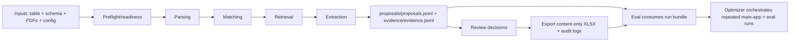

# Architecture and data flow

## Dependency boundaries
- Main app emits run bundles.
- Eval consumes run bundles from files only.
- Optimizer orchestrates main app + eval.
- Eval must not import main-app runtime internals.
- Optimizer must not reimplement eval or main-app logic.

## Key contracts
- Run bundle contract: `specs/spec.md` and `specs/contracts/`
- Artifact schemas: `specs/contracts/schemas/`
- Canonical CLI: `scripts/papers_to_table.py`
