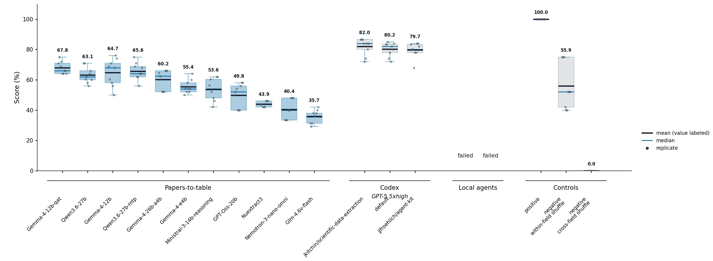
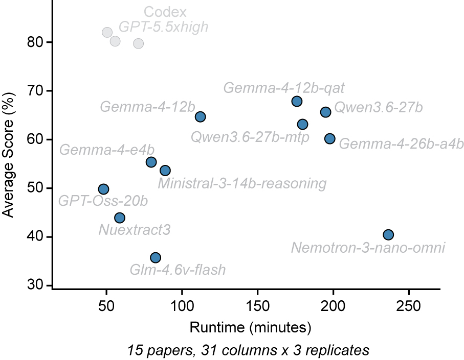

# Model Choice

Start with `google/gemma-4-e4b`. It is the checked-in default, development reference, and simplest choice for a first run.

Model choice affects extraction quality, runtime, memory use, and structured-output reliability. A larger or slower model is not automatically better for every paper or field, so treat the choices below as practical starting points only. And obviously new models are released frequently, below is a snapshot of Spring 2026.

## Practical Choices

| Goal | Model | Guidance |
|---|---|---|
| Current development default | `google/gemma-4-e4b` | Start here. Keeps runs comparable with current development checks and was the fastest of these four models in the 2026-06-15 comparison. |
| Stronger quality/runtime | `google/gemma-4-12b` | Substantially improved score over e4b but slower. |
| Non-Gemma reference | `qwen/qwen3.6-27b` | For model-family checks, but considerably slower than regular Gemma 12B in this comparison. |
| Quality ceiling | `google/gemma-4-12b-qat` | Highest-scoring local model in this comparison, but modest gain over regular 12B came with much longer runtime. |

| Model | Tested quantization | Content-correctness | Comparison runtime |
|---|---|---:|---:|
| `google/gemma-4-e4b` | `Q4_K_M` | 55.4% | 1.33 h |
| `google/gemma-4-12b` | `Q4_K_M` | 64.7% | 1.87 h |
| `qwen/qwen3.6-27b` | `Q4_K_M` | 65.6% | 3.25 h |
| `google/gemma-4-12b-qat` | `Q4_0` | 67.8% | 2.93 h |

These are results from optimizer run `20260615_004637_compare_models`, which covered three benchmark datasets, 15 papers, 31 target columns, and three replicates on an RTX 3090 workstation. See the [full model and GGUF quantization table](../tools/optimizer.md#model-quantization) for all 11 local candidates. `QAT` is part of the model family name; the tested runtime file was quantized as `Q4_0`.

## Quality Across Tested Candidates



*Content-correctness scores from the 2026-06-15 model comparison. Gray points are replicate scores, blue lines are medians, black lines are means, and the numbers above the boxes give those means to one decimal percentage point. External agent baselines and gold-derived controls provide context but are not local model candidates. See [Interpreting benchmark scores](../tools/benchmark-datasets.md#interpreting-benchmark-scores) before treating the values as literal error rates.*

## Quality Versus Runtime

The main lesson is that more runtime did not consistently produce a higher score. Regular Gemma 12B offered a useful quality/runtime balance in this sweep, while e4b remains the current default for development continuity and faster iteration.



*Average content-correctness versus comparison runtime for the same run. Local-model timings were measured on the benchmark workstation with 16 cores, 32 threads, 32 GB RAM, and an RTX 3090 GPU. The pale points are results on the external commercial Codex app with GPT-5.5 xhigh.*

## Change And Check A Model

1. Download and load the intended model quantization in LM Studio.
2. Set `provider.text_model.model_id` in `app/config.json` to the exact LM Studio model identifier.
3. Keep `provider.vision_model.model_id` aligned when you want the same model to handle targeted figure review, or configure a separate compatible vision model deliberately.
4. Run preflight before extraction:

```bash
python scripts/papers_to_table.py preflight --config app/config.json
```

For a controlled one-benchmark comparison, use the [Optimizer development check](../tools/optimizer.md#development-check) with `--model MODEL_ID` rather than comparing models from unrelated runs.

Record the exact GGUF filename or equivalent weight revision when publishing new benchmark results. A model ID without its quantization is not a complete reproducibility record.
