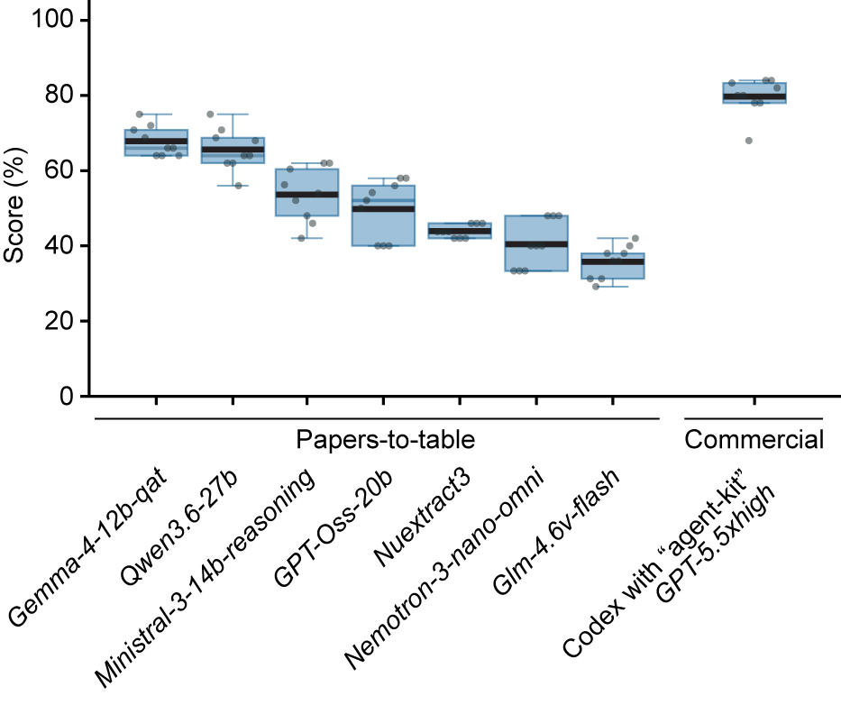

# Papers-to-table

Papers-to-table is a local-first system for extracting information from scientific PDFs into structured tables. Extracted infos can be for instance: technical parameters, descriptions of results, or claims made in a publication. The app links extracted values to text quotes with direct pdf highlights for human review. Every run bundles audit artifacts. There are also companion tools for getting benchmarking scores and for optimizing parameters or models.

*The achievable ceiling [is not 100%, but more likely 80-90%](tools/benchmark-datasets.md#interpreting-benchmark-scores) because some fields in the current benchmark datasets do not have a single correct answer. Shown: [Eval scores](tools/eval.md) for different tools. 3 replicates x 3 benchmark datasets (15 papers, 31 information fields) = total of 1,395 extractions for each tool. Each point = one replicate of one benchmark dataset. Bars show mean.*

## What The System Does

- Reads one spreadsheet, one schema, and a directory of PDFs.
- Parses and matches PDFs to table rows.
- Proposes source-linked values.
- Lets a reviewer accept, edit, reject, or confirm no data.
- Exports a content-only workbook copy plus audit artifacts.

## Primary Workflow

1. Browser mode is the regular workflow which includes human-review.

## Secondary Workflows

1. Command-line interface usage for direct agent use or other programmatic use-cases. 
2. Eval tool scoring against benchmark "gold" data.
3. Optimizer orchestrator tool can run benchmarking studies to compare models, prompts, and parameters.

## Agent Skills

1. "local-app" skill so that an agent can use the locally installed app with LM Studio.
2. "agent-kit" skill, a standalone skill that enables information extraction and human-review interface for commercial agents such as Codex or Claude.
