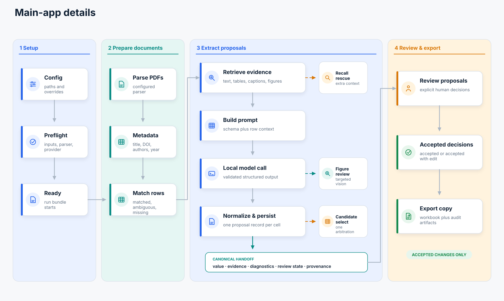
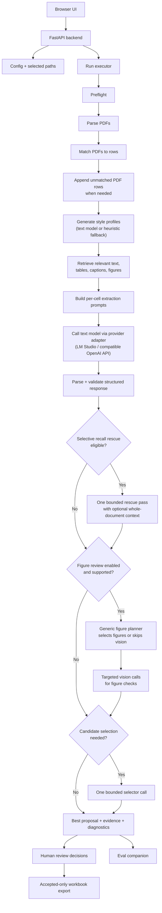

# Architecture

## Detailed Run Lifecycle

Browser and headless runs use the same backend executor.

1. Resolve paths and verify input, parser, provider, and output readiness.
2. Create `{output_dir}/{run_id}` and write initial metadata.
3. Parse PDFs into normalized documents, page images, figures, and diagnostics.
4. Match extracted paper metadata to table rows. Explicit DOI fields and DOI-shaped Link/URL values are normalized first; exact and near-complete titles then use both token overlap and shorter-title containment, with ambiguity checks still applied. A DOI whose candidate row sharply contradicts the extracted title keeps weighted evidence but not the automatic identifier-match floor, so an unrelated front-matter DOI cannot override a near-exact title.
5. Stage a new row for each unmatched PDF, using available title, author, year, and DOI metadata. Matching artifacts keep that case counted as unmatched and staged-new rather than relabeling it as an existing-row match; extraction is nevertheless unblocked against the staged row index.
6. Build or load a prepared index for each paper.
7. Retrieve relevant text, table, caption, and figure chunks for each eligible cell.
8. Build one style profile per column when enabled. Filled cells guide a model-generated profile; otherwise the app uses heuristic or schema-only guidance.
9. Build and send each cell prompt through the configured provider adapter.
10. If evidence is weak or missing, optionally run one recall-rescue pass. It may use bounded whole-document context when configured.
11. Parse, validate, and format-normalize the structured response.
12. Optionally review relevant figures with the vision path.
13. If the collected candidates remain uncertain, run at most one candidate-selection call.
14. Persist one canonical proposal per cell, with its evidence and optional selection diagnostics.
15. Update proposals, diagnostics, provider diagnostics, and progress artifacts throughout the run.
16. Record human review decisions. In headless mode, `--accept-all` records automation decisions.
17. Export a new spreadsheet containing accepted proposals only.

### Extraction Mechanics

- Prepared indexes live under `retrieval/_indexes/`. Fingerprint and scoring-context guards prevent stale reuse; diagnostics identify indexes built, loaded from disk, or reused from memory.
- Normalization repairs recoverable structure, types, and formatting. It does not rewrite the answer's meaning.
- Each cell persists one final proposal with its text, rescue, recovery, and figure evidence.
- The main app finishes proposal generation before optimizer-launched eval begins.
- LM Studio operations share a lock by default. Configurable request, vision, model, and lock-wait timeouts are recorded in provider diagnostics.

## Figure Review

Figure review is a selective per-cell check, not a required pass for every figure.

- **Eligibility:** `figure_review.enabled` is on, a vision model and figures are available, and the cell has a visual request or weak, missing, or conflicting text evidence. Strong non-visual answers are not sent to vision only for confirmation.
- **Planning:** A text-only planner may skip vision, select figures, or request full-page images. The default cap is one planner call, two selected figures, and two vision calls per cell.
- **Images:** Valid figure crops are preferred. Layout-sensitive checks may use a planner-requested full page (`full_page_preferred`); missing or suspicious crops use a fallback page (`full_page_fallback`). Retrieval remains figure-level, not panel-level.
- **Evidence:** Usable vision results are stored with the proposal. Conflicts remain competing evidence for optional candidate selection.
- **Prompt-only mode:** Structured prompt-only vision is allowed by default. Set `figure_review.skip_when_prompt_only_degraded` to skip it.

## Flowchart

