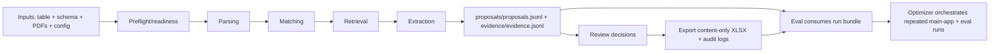

(placeholder, this page should describe in more detail how the app actually works, what is happening step by step, best with some good example text snippets)

# Architecture and data flow
(placeholder, we need a better diagram here, it can be ascii, or in some other way, but needs to be accurate and detailed and informative)
