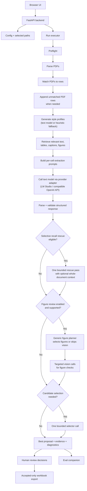

# Architecture

papers-to-table is a local-first app with three layers:

- Browser frontend: run setup, live run list, proposal review, and export.
- Backend API: config resolution, preflight, run orchestration, review endpoints, assets, and exports.
- Run bundle: filesystem artifacts that connect the main app, eval, optimizer, and audits.

## Run Lifecycle

Browser runs start when the user clicks "Start Run" and the frontend sends the selected config. Headless runs use the same backend executor through the command line.

1. The backend resolves paths and runs readiness checks.
2. If readiness passes, the run executor creates `{output_dir}/{run_id}` and writes early run metadata.
3. The parser converts each PDF into normalized document JSON, page images, figures, and parser diagnostics.
4. Matching compares extracted paper metadata against table rows.
5. Unmatched PDFs: new in-memory table rows are created from extracted title, authors, year, and DOI when available.
6. Retrieval builds or loads a prepared per-paper index, then selects relevant document chunks for each eligible target cell, including text, tables, captions, and figure-level chunks.
7. If style profiles are enabled and pre-filled cells exist, they are generated once per column. The text model (via LM Studio) analyzes the format, length, tone, units, and value shape of already filled cells and returns a compact format descriptor. If no filled cells exist, a default style profile is used instead. If style profiles are disabled in config, this stage is skipped entirely and extraction continues with schema guidance only.
8. Prompt builder composes a per-cell instruction package from schema guidance and the style profile when one exists.
9. The backend sends each prompt package to the text model by an OpenAI-compatible HTTP call to the model provider endpoint (LM Studio). Extraction may run one bounded recall-rescue pass when generic evidence-quality signals indicate weak or missing evidence. If `retrieval.whole_document_mode` is enabled and the parsed document fits the configured size bound, that rescue pass may include whole-document context.
10. Structured output from LM Studio is parsed and validated against the field schema. Output is normalized to fit format (for example: trimming wrappers, coercing numeric strings to numbers, mapping yes/no variants to booleans, deduplicating list items, and attaching units in a consistent format). 
11. Optional figure review by the vision model via LM Studio. This is decided per cell, and done when: figure review is enabled config, evidence-aware triggers indicate likely value (for example weak/unclear/contradictory text evidence, missing value with promising figures, or a visual request), and figures are available. Direct figure context alone does not trigger vision for a strong non-visual text answer. A generic text-only figure planner can inspect the cell request, first-pass answer, retrieved snippets, and figure catalog before any vision call. It may skip vision, select up to the configured figure cap, or ask for full-page images when layout or panel counting matters.
12. Figure review outputs are kept as first-class evidence. Conflicting figure evidence is preserved as competing evidence instead of being silently discarded.
13. If multiple candidates, weak evidence, rescue usage, or text/figure conflicts make final selection uncertain, extraction may run one bounded candidate-selection call. Candidate selection compares generic candidates from the first text pass, rescue pass, evidence recovery, and figure review; it does not introduce recursive retries or benchmark-specific rules.
14. Proposals are normalized to the canonical proposal/evidence contract and one final proposal record is persisted for each target cell that reached a cell-level semantic outcome, with optional `candidate_answers` and `selection_diagnostics` when selection was considered.
15. Run artifacts are updated incrementally: proposals, diagnostics, provider diagnostics, and progress state.
16. Human review records explicit decisions, or headless `--accept-all` records automation decisions.
17. Export writes a spreadsheet with accepted proposals only.

### Extraction Mechanics

- Normalization is a post-parse repair step for recoverable formatting and typing issues, not a semantic rewrite of the model answer.
- Style profiles are generated by the text model when enabled and filled cells exist; otherwise a heuristic fallback is used, and if the feature is disabled the prompts fall back to schema guidance only. No raw values are copied into prompts or persisted profiles.
- Figure review is selectively invoked per cell using evidence-aware triggers; no per-column schema vision policy is required. The trigger gate no longer calls vision only to confirm a strong non-visual text answer.
- Figure retrieval is figure-level only. The app may ask the vision model to inspect a figure crop or a full-page fallback, but it does not create panel-level retrieval chunks.
- Prepared retrieval indexes are run artifacts under `retrieval/_indexes/`. They preserve source-grounded chunks and lexical scoring metadata, include document fingerprint and typed-scoring-context guards, and report whether each cell used an index built fresh, loaded from disk, or reused from memory.
- Prompt-only vision responses are repaired for recoverable schema issues such as omitted optional diagnostics and `numeric_value_form: "N/A"`. A figure response that proposes a value must include the extracted answer in `proposed_value`; otherwise it is not usable figure evidence.
- Candidate selection is optional and bounded to at most one extra selector call per cell. It is used only to adjudicate collected generic candidates when uncertainty warrants it, and figure-derived candidates must directly answer the field before they can override strong text evidence.
- The current persisted contract is one final proposal per cell, with text, rescue, recovery, and figure evidence co-located for auditability.
- Extraction, eval, and optimizer runs are phase-separated. The main app finishes all extraction proposals before optimizer-launched eval starts. Eval scores deterministic cells first, then runs text judging in judge-major batches grouped by provider, model, and settings.
- LM Studio calls are serialized through a shared lock by default. Load, unload, text completion, vision completion, structured-output probes, and eval judge completions do not run concurrently against the same local LM Studio server unless the operator explicitly disables the lock.
- Local LM Studio timeouts are configurable and conservative by default: request, vision request, model load, model unload, and lock wait limits are recorded in provider diagnostics.

## Figure Review

Figure review is controlled by `figure_review.enabled` in the config. When enabled and a vision model is configured, extraction may call the vision path for targeted figure checks. Prompt-only structured vision is allowed by default; `figure_review.skip_when_prompt_only_degraded` can opt out.

The default figure-review path is planner-enabled and capped: one planner call, up to two selected figures, and up to two actual vision calls per cell. Valid crops are used by default; missing or suspicious crops fall back to full-page images. Planner-requested full-page images are recorded as `full_page_preferred`, while crop failures that fall back are recorded as `full_page_fallback`.

Runtime diagnostics distinguish triggered, attempted, succeeded, failed, and suppressed figure review. Proposal and run diagnostics also record planner outcomes, planner skip reasons, image source, fallback reason, retry/repair signals, promoted unclear values, dropped/no-hit reasons, accepted figure hits, successful vision calls without usable figure hits (`succeeded_without_hit_count`), and candidate-selection decisions that block figure evidence from overriding stronger text evidence.
