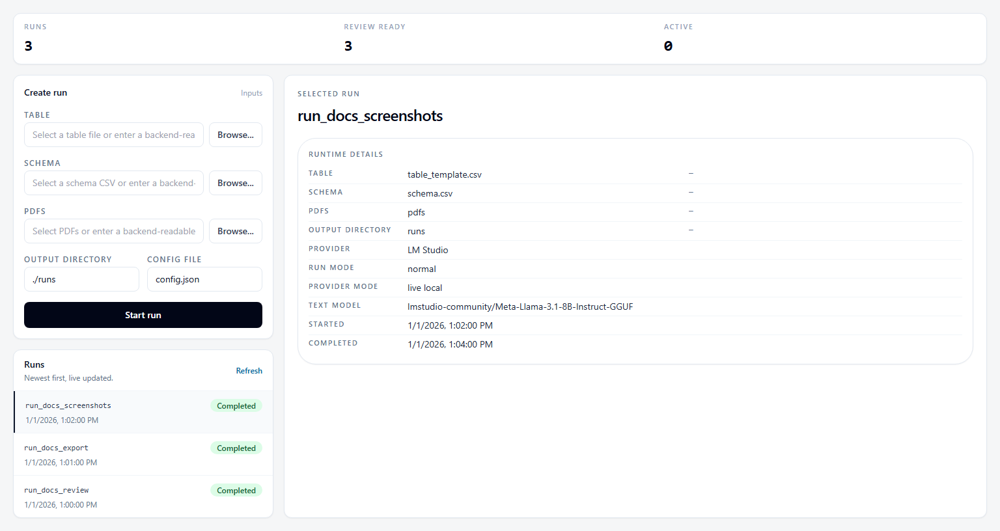
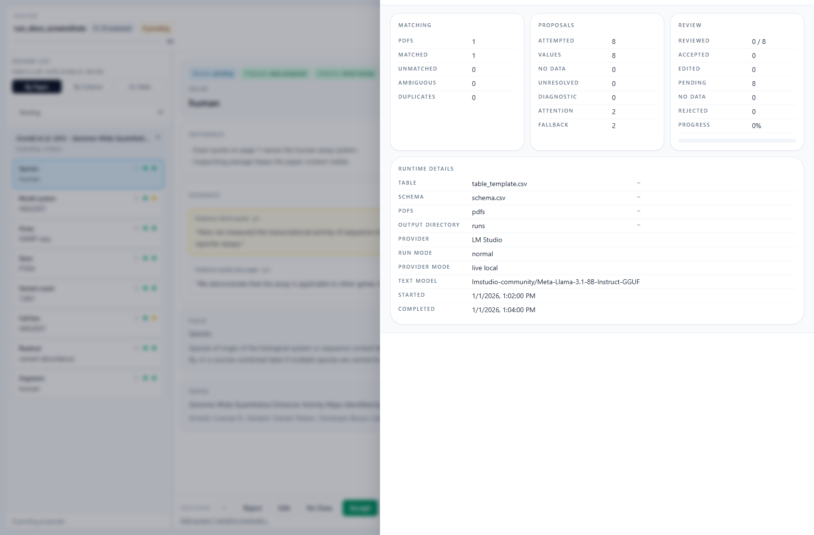
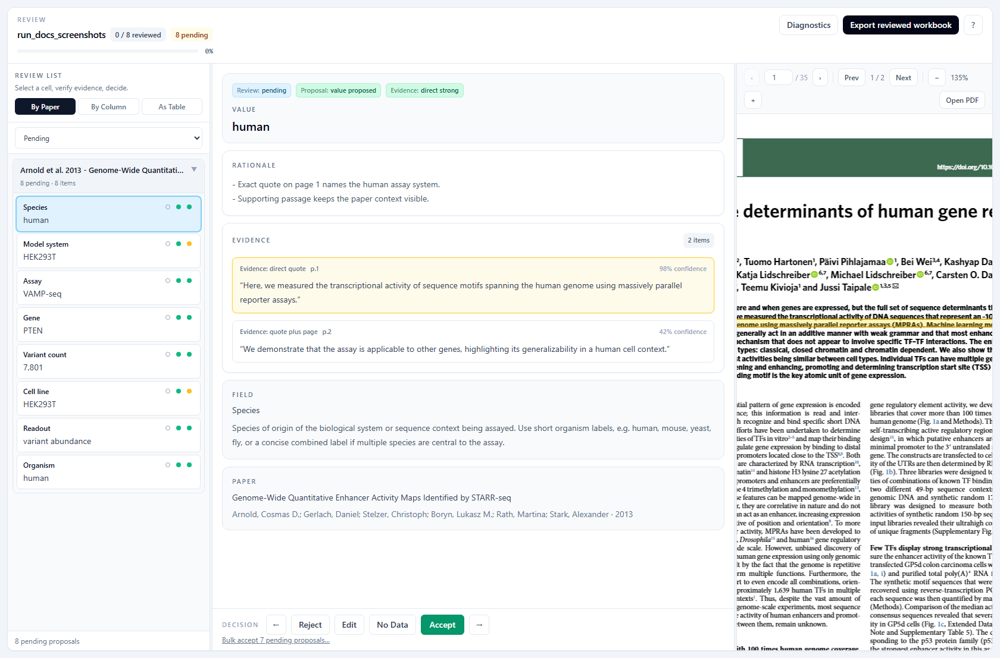

# Browser Review

Browser review is the primary workflow where the user can inspect evidence, and accept or edit proposals. The main app ingests PDFs and a spreadsheet that defines the required reported information, proposes source-linked values, supports review in a browser UI, and exports the results as a spreadsheet. Evidence in this workflow means inspectable publication context for the extracted value; the app does not evaluate whether a publication's claims are scientifically supported or true.

## Start The App

From the repository root:

```bash
python scripts/papers_to_table.py review
```

Then open `http://127.0.0.1:5173`.

## Before You Start

1. Confirm LM Studio is running with the configured model loaded or available.
2. Prepare a table and schema.
3. Keep `app/config.json` for provider, parser, retrieval, prompt, diagnostics, and figure-review settings.
4. Leave `table_path`, `schema_path`, `pdf_dir`, and `output_dir` blank if you prefer to select them in the browser.

```bash
python scripts/papers_to_table.py preflight --config app/config.json
```

## Run Setup


- Start from the Run tab.
- Select the table, schema, PDF files, and output directory in the interface, or type backend-readable paths.
- If those paths are already present in `app/config.json`, they are used as defaults and can still be overridden for a single run.
- Use the selected-run detail pane to confirm labeled runtime details such as run mode, provider mode, provider, models, warnings, and resolved input locators without relying on ambiguous chips.



## Review Workspace


- The default review viewport is a contained three-panel workspace: a table-oriented review list on the left, proposal detail and decisions in the middle, and evidence/PDF inspection on the right.
- The left pane opens in **As Table** mode and can switch to **By Paper** or **By Column** for grouped triage. The grouped queue defaults to actionable pending proposals and scrolls independently from the rest of the workspace.
- The screenshot above uses **By Paper** mode so the set of extraction fields is immediately visible; the selected evidence highlight is centered in the PDF viewer.
- The detail pane keeps the selected paper, field, proposed value, ordered evidence list, and review actions together, with its own internal scroll region.
- The evidence panel keeps the PDF toolbar visible while the PDF page area scrolls independently for document inspection.
- The top review bar stays compact: current run context, review progress, diagnostics, export, and keyboard help.

## Evidence Semantics

- Proposal records use canonical proposal/evidence semantics: `proposal_status`, `evidence_status`, derived/validated `review_bucket`, and `reason_codes`.
- Evidence links proposals to publication passages, tables, captions, figures, or reasoning context so reviewers can inspect where the extracted information came from. It is not a downstream scientific claim-support judgment.
- The default queue remains focused on review-surface cells. It can include unresolved target cells with no proposed value when they carry useful rationale, reason codes, or retrieval/candidate context; global diagnostics stay in summaries/diagnostics.
- Figure/vision evidence and approximate/fallback anchors are shown as provenance/evidence-quality metadata. They do not create a warning icon unless a separate caution condition is present.
- The visible All filter means all non-diagnostic review-surface records; diagnostic records remain available through summaries and diagnostics views.
- Direct quote: exact highlight anchored to page text.
- Approximate highlight: region-level fallback when exact quote alignment fails.
- Quote plus page: text fallback with page reference when highlight geometry is unavailable.
- Inferred reasoning or calculation: reviewer-visible evidence statuses that stay distinct from direct quotes.
- Figure evidence, when present, is labeled separately from text evidence.

## Provider, Parsing, And Fallback Truth

- The canonical live provider token is `lm_studio`.
- The UI surfaces provider mode directly: `live local`, `live cloud`, `unavailable`, `disabled`, or `stub/demo` when applicable.
- If the configured live provider is unavailable at startup, the run fails during readiness check.
- Parsing fallback, OCR fallback, duplicate conflicts, and evidence fallback should stay visible through warnings, summaries, and the diagnostics surface.

## Diagnostics Drawer



- Diagnostics are secondary by default and open in a dedicated drawer instead of permanently taking review-space away from evidence inspection.
- The drawer keeps warnings, unmatched PDFs, ambiguous matches, duplicate conflicts, and related run-summary context available without displacing the current proposal selection.

## Scrollable Review Surfaces




- The proposal queue, proposal detail pane, and evidence viewer each scroll independently.
- Review actions stay available while long proposal notes or tall PDF pages are inspected.

## Explicit Export


1. Review proposals in the browser.
2. Accept only the values you want recorded.
3. Click "Export reviewed workbook".
4. Download the workbook and JSON artifacts, or open them directly from `{output_dir}/{run_id}/exports/`.

Only explicitly accepted values are exported. Rejected, unreviewed, and confirmed-no-data outcomes are excluded.
