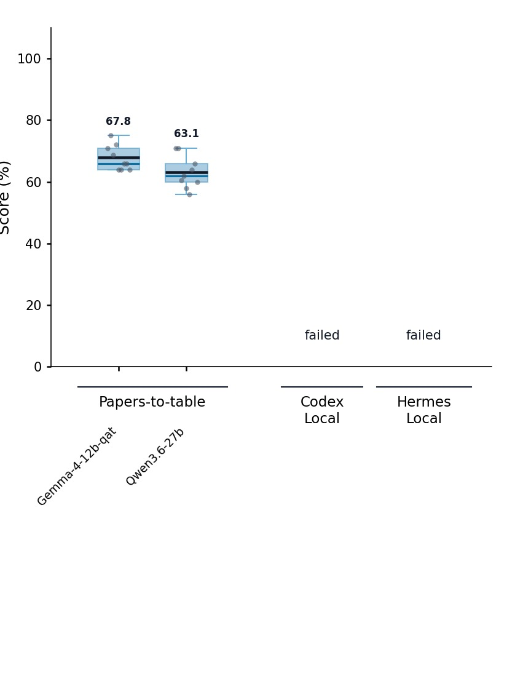

# Benchmark Datasets

Curated benchmark datasets live at the repository root under `benchmark_datasets/` so they are visible to users and usable by the app, Eval, and Optimizer.

## Gold datasets for eval scoring

Each dataset has the same basic shape:

- `table_template.csv`: app-facing input table with stable `row_id` / `row_index`, paper metadata, and blank target cells.
- `schema.csv`: extraction schema used by the main app. The descriptions become prompt instructions.
- `table_gold.csv`: human-curated answer table.
- `pdfs/`: source PDFs for the benchmark.

Available datasets:

- `massively_parallel_reporter_assays`
- `genome_editing_tools`
- `spatial_transcriptomics`

## Interpreting benchmark scores

Content-correctness scores measure agreement under the current Eval rubric with human-curated gold answers. They are useful for comparing candidates but currently a score of 80%  does not mean that 20% of the extracted values are objectively wrong. It is true that most benchmark fields ask for objectively recoverable facts such as identifiers, counts, or reported numeric values. But other fields, such as a paper's "main finding," may have more than one answer. The "gold" positive control reaches 100% by construction because it is scored against itself, but the realistic achievable ceiling is likely lower due to such ambiguous fields. Therefore it is possible that the score with the current benchmark datasets is almost saturated at 80%.

TODO: We should improve the benchmark in the future, so that all extraction tasks can objectively be correct.

## Controls

These are positive and negative controls.

- `benchmark_datasets/data/20260517_gold` is the positive control "gold", it is a copy of the perfect solution, the human-curated answer table.
- `benchmark_datasets/data/20260710_gold_word_shuffle` negative control, uses the perfect solution and shuffles word order within each cell.
- `benchmark_datasets/data/20260710_gold_cross_field` negative control, uses the perfect solution and moves values across rows and columns within each dataset.

## Commercial agents

For this the same prompt was used in the Codex App to extract information from the benchmark datasets.

- `benchmark_datasets/data/20260517_ext_codex` Codex default.
- `benchmark_datasets/data/20260517_ext_kitchin` Codex with skill "scientific-data-extraction" (https://github.com/jkitchin/skillz/tree/main/skills/research/scientific-data-extraction, commit 3e74b2f).
- `benchmark_datasets/data/20260517_ext_agentkit` Codex with skill "papers-to-table-agent-kit", which includes a interface for human-review, from this repo.

Each folder is organized by replicate:

```text
rep1/{benchmark_name}_filled.csv
rep2/{benchmark_name}_filled.csv
rep3/{benchmark_name}_filled.csv
```

## Local-agent attempts
Local agent systems such as Hermes or Codex running with local models could be an alternative. But unfortunately such attempts failed and either errored or stopped after a fraction of the task.

Papers-to-table enables long-running extractions with local LLMs, while the tested Codex Local and Hermes Local configurations did not complete a scorable extraction:



*Content-correctness [Eval scores](eval.md) for completed local papers-to-table runs in optimizer run `20260615_004637_compare_models`. Numbers above the boxes give mean scores to one decimal percentage point. “Failed” means the specific Codex App and Hermes configurations described below produced no complete scorable result.*

### Codex App with local models

Failed so far. Codex App v26.707.31123 was tested with `google/gemma-4-12b-qat`, `google/gemma-4-12b`, and `qwen/qwen3.6-27b`. Using the same prompt as for the commercial agents above. Configurations included 32K and 64K contexts and different tool-calling limits. Runs usually stopped before filling target information and frequently reported connection errors in the response stream. No complete scorable result was produced.

### Hermes with local models

Failed so far. Hermes v0.18.2 was used out of the box, without additional customization, with `google/gemma-4-12b-qat` and `google/gemma-4-26b-a4b`. Using the same prompt as for the commercial agents above. Runs failed by being unable to establish a reliable Python PDF-text extraction workflow despite PyMuPDF being installed, entering repetitive output loops, or declaring completion after only 1-3 of 31 columns (about 3-10% of the attempted task). No complete scorable result was produced.

## Gold datasets tables in detail

<details class="gold-table-details">
<summary>Massively parallel reporter assays gold table</summary>

<div class="gold-table-scroll">
<table>
<thead>
<tr>
<th>row_id</th>
<th>row_index</th>
<th>Authors</th>
<th>Publication Year</th>
<th>Title</th>
<th>Journal</th>
<th>Link</th>
<th>Synthetic designs</th>
<th>Cloning</th>
<th>Species</th>
<th>Model system</th>
<th>Episomal vs genomic</th>
<th>Integration method</th>
<th># Variants tested</th>
<th>length of sequences (bp)</th>
<th>Where is the BC?</th>
<th>BC length (bp)</th>
<th>RNA library</th>
<th>UMI?</th>
</tr>
</thead>
<tbody>
<tr>
<td>row_ada7eaffa789</td>
<td>0</td>
<td>Sahu, Biswajyoti; Hartonen, Tuomo; Pihlajamaa, Paivi; Wei, Bei; Dave, Kashyap; Zhu, Fangjie; Kaasinen, Eevi; Lidschreiber, Katja; Lidschreiber, Michael; Daub, Carsten O.; Cramer, Patrick; Kivioja, Teemu; Taipale, Jussi</td>
<td>2022</td>
<td>Sequence determinants of human gene regulatory elements</td>
<td>Nature Genetics</td>
<td>https://www.nature.com/articles/s41588-021-01009-4</td>
<td>+</td>
<td>restriction</td>
<td>human</td>
<td>HepG2, GP5d, RPE1</td>
<td>episomal</td>
<td>none</td>
<td>27,000,000 motif; 2,000,000,000 genomic; 2,000,000,000 random</td>
<td>49, 500, 150, 170</td>
<td>no BC</td>
<td>no BC</td>
<td>reporter-specific RT</td>
<td>no</td>
</tr>
<tr>
<td>row_58d43022398a</td>
<td>1</td>
<td>Trauernicht, Max; Filipovska, Teodora; Rastogi, Chaitanya; van Steensel, Bas</td>
<td>2024</td>
<td>Optimized reporters for multiplexed detection of transcription factor activity</td>
<td>Cell Systems</td>
<td>https://doi.org/10.1016/j.cels.2024.11.003</td>
<td>+</td>
<td>restriction</td>
<td>mouse, human</td>
<td>mESC, mNPC, HEK293, K562, HEPG2, U2OS, MCF7, A549, HCT116</td>
<td>episomal</td>
<td>none</td>
<td>5,530</td>
<td>202</td>
<td>5'UTR</td>
<td>13</td>
<td>Reverse transcription with gene-specific primer targeting GFP ORF, PCR adding Illumina adapters.</td>
<td>yes</td>
</tr>
<tr>
<td>row_57efc4548754</td>
<td>2</td>
<td>Arnold, Cosmas D.; Gerlach, Daniel; Stelzer, Christoph; Boryn, Lukasz M.; Rath, Martina; Stark, Alexander</td>
<td>2013</td>
<td>Genome-Wide Quantitative Enhancer Activity Maps Identified by STARR-seq</td>
<td>Science</td>
<td>https://www.science.org/doi/10.1126/science.1232542</td>
<td>-</td>
<td>not found</td>
<td>fly, human</td>
<td>S2, OSC, HeLa</td>
<td>episomal</td>
<td>none</td>
<td>11,300,000</td>
<td>600</td>
<td>no BC</td>
<td>no BC</td>
<td>Poly(A) selection, targeted RT, PCR</td>
<td>no</td>
</tr>
<tr>
<td>row_5c64c492c602</td>
<td>3</td>
<td>Cornwall-Scoones, Jake; Benzinger, Dirk; Yu, Tianji; Pezzotta, Alberto; Sagner, Andreas; Gerontogianni, Lina; Bernadet, Shaun; Finnie, Elizabeth; Boezio, Giulia L. M.; Stuart, Hannah T.; Melchionda, Manuela; Inge, Oliver C. K.; Dumitrascu, Bianca; Briscoe, James; Delas, M. Joaquina</td>
<td>2025</td>
<td>Predictable Engineering of Signal-Dependent Cis-Regulatory Elements</td>
<td>bioRxiv</td>
<td>https://www.biorxiv.org/content/10.1101/2025.03.07.642002v1</td>
<td>+</td>
<td>golden gate</td>
<td>mouse</td>
<td>neural tube differentiation from mESCs</td>
<td>genomic</td>
<td>Lenti</td>
<td>13,991</td>
<td>608</td>
<td>3'UTR</td>
<td>24</td>
<td>none</td>
<td>no</td>
</tr>
<tr>
<td>row_21a81ec110cd</td>
<td>4</td>
<td>King, Dana M.; Hong, Clarice Kit Yee; Shepherdson, James L.; Granas, David M.; Maricque, Brett B.; Cohen, Barak A.</td>
<td>2020</td>
<td>Synthetic and genomic regulatory elements reveal aspects of cis-regulatory grammar in mouse embryonic stem cells</td>
<td>eLife</td>
<td>https://doi.org/10.7554/eLife.41279</td>
<td>+</td>
<td>restriction</td>
<td>mouse</td>
<td>mESC</td>
<td>episomal</td>
<td>none</td>
<td>1,438</td>
<td>40-80</td>
<td>3'UTR</td>
<td>9</td>
<td>cDNA synthesis with oligo dT, PCR amplification 13 cycles, XbaI/XhoI digest, ligation to Illumina adapters, enrichment PCR.</td>
<td>no</td>
</tr>
</tbody>
</table>
</div>

</details>

<details class="gold-table-details">
<summary>Genome editing tools gold table</summary>

<div class="gold-table-scroll">
<table>
<thead>
<tr>
<th>row_id</th>
<th>row_index</th>
<th>Authors</th>
<th>Publication Year</th>
<th>Title</th>
<th>Journal</th>
<th>DOI</th>
<th>Editing modality</th>
<th>Main editor or system name</th>
<th>Best or selected variant</th>
<th>Primary assay system</th>
<th>Max editing efficiency (%)</th>
<th>Main or best editor architecture</th>
<th>Architecture source figure</th>
<th>Number of bar-chart panels in Figure 3</th>
<th>DNA extraction or genotyping method</th>
<th>Main improvement claim</th>
</tr>
</thead>
<tbody>
<tr>
<td>row_b1e4a4b00433</td>
<td>0</td>
<td>Peter J. Chen; Jeffrey A. Hussmann; Jun Yan; Friederike Knipping; Purnima Ravisankar; Pin-Fang Chen; Cidi Chen; James W. Nelson; Gregory A. Newby; Mustafa Sahin; Mark J. Osborn; Jonathan S. Weissman; Britt Adamson; David R. Liu</td>
<td>2021</td>
<td>Enhanced prime editing systems by manipulating cellular determinants of editing outcomes</td>
<td>Cell</td>
<td>10.1016/j.cell.2021.09.018</td>
<td>prime editing</td>
<td>PE4 and PE5 prime editing systems</td>
<td>PE5max with epegRNAs</td>
<td>HeLa, K562, HEK293T</td>
<td>65</td>
<td>bpNLSsv40_SpCas9-R221K-N394K-H840A_SGGSx2-bpNLSsv40-SGGSx2_MMLV-RT-codon-opt_bpNLSsv40_NLScmyc</td>
<td>Fig. 7a</td>
<td>2</td>
<td>gDNA lysis buffer 1.5-2 hrs at 37C, PCR amplicon sequencing with 280-300 single-read cycles on Illumina MiSeq and analyzed with CRISPResso2</td>
<td>MMR inhibition, PEmax, and epegRNAs synergistically improve prime editing efficiency and purity</td>
</tr>
<tr>
<td>row_6d2b8d92f7f0</td>
<td>1</td>
<td>Fatwa Adikusuma; Caleb Lushington; Jayshen Arudkumar; Gelshan I. Godahewa; Yu C. J. Chey; Luke Gierus; Sandra Piltz; Ashleigh Geiger; Yatish Jain; Daniel Reti; Laurence O.W. Wilson; Denis C. Bauer; Paul Q. Thomas</td>
<td>2021</td>
<td>Optimized nickase- and nuclease-based prime editing in human and mouse cells</td>
<td>Nucleic Acids Research</td>
<td>10.1093/nar/gkab792</td>
<td>prime editing</td>
<td>PEA1</td>
<td>PEA1</td>
<td>HEK293T, HeLa, K562</td>
<td>95</td>
<td>Cas9n_RT_T2A-Puro-GFP</td>
<td>Fig. 1a</td>
<td>2</td>
<td>Roche High Pure PCR Template Preparation Kit, PCR amplicon sequencing with 500 paired-end cycles on MiSeq Nano and analyzed with the R-GENOME PE-Analyzer online tool</td>
<td>All-in-one PEA1-Puro plus selection produces high PE3 efficiencies in HEK293T cells</td>
</tr>
<tr>
<td>row_ca1c2a805200</td>
<td>2</td>
<td>Seonghyun Lee; Hyunji Lee; Gayoung Baek; Jin-Soo Kim</td>
<td>2023</td>
<td>Precision mitochondrial DNA editing with high-fidelity DddA-derived base editors</td>
<td>Nature Biotechnology</td>
<td>10.1038/s41587-022-01486-w</td>
<td>mitochondrial base editing</td>
<td>HiFi-DdCBEs</td>
<td>T1391A HiFi-DdCBE</td>
<td>HEK293T</td>
<td>60.7</td>
<td>TALE_DddAtox_UGI and UGI-DddAtox-DdCBE</td>
<td>Fig. 1a</td>
<td>1</td>
<td>DNeasy Blood &amp; Tissue Kit, PCR amplicon sequencing with paired-end on Illumina MiniSeq and analyzed with CRISPR RGEN online tool</td>
<td>Interface-engineered DdCBEs largely avoid mitochondrial off-target C-to-T editing while retaining on-target activity</td>
</tr>
<tr>
<td>row_bab7dff9ba77</td>
<td>3</td>
<td>Alexis C. Komor; Kevin T. Zhao; Michael S. Packer; Nicole M. Gaudelli; Amanda L. Waterbury; Luke W. Koblan; Y. Bill Kim; Ahmed H. Badran; David R. Liu</td>
<td>2017</td>
<td>Improved base excision repair inhibition and bacteriophage Mu Gam protein yields C:G-to-T:A base editors with higher efficiency and product purity</td>
<td>Science Advances</td>
<td>10.1126/sciadv.aao4774</td>
<td>cytosine base editing</td>
<td>BE4-Gam</td>
<td>BE4-Gam</td>
<td>HEK293T</td>
<td>65</td>
<td>Gam_16aa_APOBEC1_32aa_Cas9n-D10A_9aa_UGI_9aa_UGI</td>
<td>Fig. 6a</td>
<td>2</td>
<td>gDNA lysis buffer 1 hr at 37C, PCR amplicon sequencing on Illumina MiSeq and analyzed with a custom MATLAB script</td>
<td>Gam fusion reduces indels and BE4 architecture improves C:G-to-T:A editing purity</td>
</tr>
<tr>
<td>row_29e0bbcdaa5f</td>
<td>4</td>
<td>Matthew G. Durrant; Nicholas T. Perry; James J. Pai; Aditya R. Jangid; Januka S. Athukoralage; Masahiro Hiraizumi; John P. McSpedon; April Pawluk; Hiroshi Nishimasu; Silvana Konermann; Patrick D. Hsu</td>
<td>NOT_FOUND</td>
<td>Bridge RNAs direct modular and programmable recombination of target and donor DNA</td>
<td>bioRxiv</td>
<td>NOT_FOUND</td>
<td>recombination/insertion system</td>
<td>IS621 bridge RNA system</td>
<td>reprogrammed IS621 bridge RNA</td>
<td>E. coli</td>
<td>59.5</td>
<td>IS621-recombinase</td>
<td>Fig. 3a/c</td>
<td>2</td>
<td>Nucleobond Xtra Midiprep Kit (Macherey Nagel), PCR amplicon sequencing or nanopore sequencing</td>
<td>Bridge RNA independently reprograms target- and donor-binding loops for insertion, excision, and inversion</td>
</tr>
</tbody>
</table>
</div>

</details>

<details class="gold-table-details">
<summary>Spatial transcriptomics gold table</summary>

<div class="gold-table-scroll">
<table>
<thead>
<tr>
<th>row_id</th>
<th>row_index</th>
<th>Authors</th>
<th>Publication Year</th>
<th>Title</th>
<th>Journal</th>
<th>DOI</th>
<th>Spatial platform or method</th>
<th>Species</th>
<th>Tissue or disease context</th>
<th>Section type</th>
<th>Section thickness (micrometer)</th>
<th>Spatial resolution (micrometer)</th>
<th>Main analysis output</th>
<th>Key spatial domain or cell-type finding</th>
<th>Representative spatial figure</th>
<th>Number of UMAP plot panels in Figure 1</th>
</tr>
</thead>
<tbody>
<tr>
<td>row_30ec69188019</td>
<td>0</td>
<td>Marie Schott; Daniel León-Periñán; Elena Splendiani; Leon Strenger; Jan Robin Licha; Tancredi Massimo Pentimalli; Simon Schallenberg; Jonathan Alles; Sarah Samut Tagliaferro; Anastasiya Boltengagen; Sebastian Ehrig; Stefano Abbiati; Steffen Dommerich; Massimiliano Pagani; Elisabetta Ferretti; Giuseppe Macino; Nikos Karaiskos; Nikolaus Rajewsky</td>
<td>2024</td>
<td>Open-ST: High-resolution spatial transcriptomics in 3D</td>
<td>Cell</td>
<td>10.1016/j.cell.2024.05.055</td>
<td>Open-ST</td>
<td>human, mouse</td>
<td>mouse E13 head, mouse hippocampus, human head-and-neck squamous cell carcinoma, human lymph node</td>
<td>fresh-frozen cryosections</td>
<td>10</td>
<td>0.6</td>
<td>high-resolution 3D virtual tissue blocks and cell-type/gene-expression maps</td>
<td>LYZ+ CXCL9+ CXCL10+ macrophages and cholesterol-biosynthesis activity localize at the tumor-lymphoid boundary</td>
<td>Fig. 7d</td>
<td>0</td>
</tr>
<tr>
<td>row_879daa0869e0</td>
<td>1</td>
<td>Andrew J. C. Russell; Jackson A. Weir; Naeem M. Nadaf; Matthew Shabet; Vipin Kumar; Sandeep Kambhampati; Ruth Raichur; Giovanni J. Marrero; Sophia Liu; Karol S. Balderrama; Charles R. Vanderburg; Vignesh Shanmugam; Luyi Tian; J. Bryan Iorgulescu; Charles H. Yoon; Catherine J. Wu; Evan Z. Macosko; Fei Chen</td>
<td>2024</td>
<td>Slide-tags enables single-nucleus barcoding for multimodal spatial genomics</td>
<td>Nature</td>
<td>10.1038/s41586-023-06837-4</td>
<td>Slide-tags</td>
<td>human, mouse</td>
<td>human tonsil germinal centers, human cortex, mouse brain, human melanoma</td>
<td>fresh-frozen cryosections</td>
<td>20</td>
<td>10</td>
<td>spatially mapped single-nucleus multimodal profiles</td>
<td>TFH cells are enriched in light zones of human tonsil germinal centers with CD40-CD40LG spatial interactions</td>
<td>Fig. 3h</td>
<td>1</td>
</tr>
<tr>
<td>row_482ec82011d5</td>
<td>2</td>
<td>Sanja Vickovic; Gökcen Eraslan; Fredrik Salmén; Johanna Klughammer; Linnea Stenbeck; Denis Schapiro; Tarmo Äijö; Richard Bonneau; Ludvig Bergenstråhle; José Fernandéz Navarro; Joshua Gould; Gabriel K. Griffin; Åke Borg; Mostafa Ronaghi; Jonas Frisén; Joakim Lundeberg; Aviv Regev; Patrik L Ståhl</td>
<td>2020</td>
<td>High-definition spatial transcriptomics for in situ tissue profiling</td>
<td>Nature Methods</td>
<td>10.1038/s41592-019-0548-y</td>
<td>HDST</td>
<td>human, mouse</td>
<td>mouse olfactory bulb, human breast cancer</td>
<td>fresh-frozen cryosections</td>
<td>10</td>
<td>2</td>
<td>high-resolution spatial expression patterns and cell-type assignments</td>
<td>HDST maps olfactory-bulb morphological layers and enriches layer-specific cell types</td>
<td>Fig. 1b/e</td>
<td>0</td>
</tr>
<tr>
<td>row_599ac1f595b9</td>
<td>3</td>
<td>Samuel G. Rodriques; Robert R. Stickels; Aleksandrina Goeva; Carly A. Martin; Evan Murray; Charles R. Vanderburg; Joshua Welch; Linlin M. Chen; Fei Chen; Evan Z. Macosko</td>
<td>2020</td>
<td>Slide-seq: A Scalable Technology for Measuring Genome-Wide Expression at High Spatial Resolution</td>
<td>Science</td>
<td>10.1126/science.aaw1219</td>
<td>Slide-seq</td>
<td>human, mouse</td>
<td>mouse cerebellum, mouse hippocampus, human cerebellum</td>
<td>fresh-frozen cryosections</td>
<td>10</td>
<td>10</td>
<td>cell-type maps and spatial gene-expression patterns</td>
<td>Slide-seq identifies spatially defined Purkinje-layer gene-expression bands in mouse cerebellum</td>
<td>Fig. 3b/c</td>
<td>0</td>
</tr>
<tr>
<td>row_996e4f59cad1</td>
<td>4</td>
<td>Grant Kinsler; Caitlin Fagan; Haiyin Li; Jessica Kaster; Maggie Dunne; Robert J. Vander Velde; Ryan H. Boe; Sydney Shaffer; Meenhard Herlyn; Arjun Raj; Yael Heyman</td>
<td>2025</td>
<td>SpaceBar enables clone tracing in spatial transcriptomic data</td>
<td>bioRxiv</td>
<td>10.1101/2025.02.10.637514</td>
<td>SpaceBar</td>
<td>mouse</td>
<td>mouse melanoma xenograft tumor</td>
<td>fresh-frozen cryosections</td>
<td>8</td>
<td>subcellular</td>
<td>clone-resolved high-resolution spatial gene-expression patterns</td>
<td>MITF is enriched near the tumor edge while VEGFA is enriched toward the tumor interior</td>
<td>Fig. 2e/f</td>
<td>0</td>
</tr>
</tbody>
</table>
</div>

</details>
