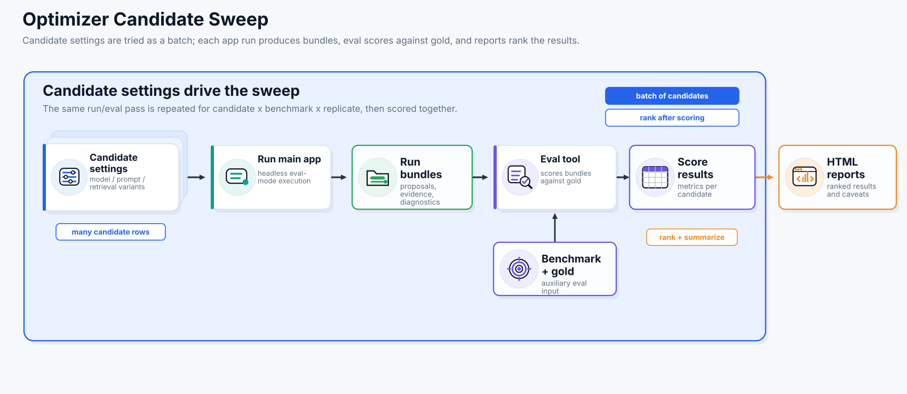

# Optimizer

Optimizer compares models, prompts, and configuration settings. It runs the main app, scores each run bundle with Eval, and writes experiment reports.



## What It Is For

Use Optimizer to answer questions such as:

- Which model should be the default?
- Which prompt bundle performs best?
- Which retrieval settings are safe to recommend?
- Does the current app still meet its development baseline?

## Install

The main installation command includes Optimizer:

```bash
python scripts/papers_to_table.py install
```

Alternative low-level install:

```bash
cd tools/optimizer
python -m pip install -e .[dev]
```

Run its tests from the repository root:

```bash
bash scripts/test-optimizer-tool.sh
```

## Recommended Commands

### Compare Models

Use this command to rank a fixed model list. It holds prompts, retrieval, and extraction features constant across the three-dataset suite and runs three replicates.

The preset is `tools/optimizer/configs/compare_models.json`. Model request settings come from `app/backend/src/backend/app/model_profiles/default_profiles.json`; explicit Optimizer settings can override them for comparisons. The wrapper delegates to `tools/optimizer/scripts/compare_models.sh`.

```bash
python scripts/papers_to_table.py optimizer compare-models
```

Options:

- `--label LABEL`: replace the timestamped run label.
- `--initial-model MODEL_ID`: restrict the preset to one text model.
- `--help`: show command help.

The full comparison includes external results and positive and negative controls. These baselines appear in Eval outputs and reports but do not compete for the winner. With 11 models and six baselines, expect an overnight run of 10 hours or more.


*Content-correctness [Eval scores](eval.md) for optimizer run `20260615_004637_compare_models`. Gray points are replicate scores, blue lines are medians, black lines are means, and the numbers above the boxes give those means to one decimal percentage point. “Failed” marks configurations without a complete scorable result. The positive control is gold data; the within-field word-shuffle and cross-field controls were added on 2026-07-10 to calibrate score sensitivity and are excluded from winner selection.*


### Development Check

Use this during implementation for one fast correctness and runtime signal. It runs one model, one benchmark, and one replicate using the canonical model-comparison settings. External baselines are removed from the run-local config.

The defaults are `google/gemma-4-e4b` and `bench_genome_editing`. Materialized settings stay inside the run directory; checked-in presets are unchanged.

```bash
python scripts/papers_to_table.py optimizer dev-check
python scripts/papers_to_table.py optimizer dev-check --label dev_check_after_parser_fix
```

Options:

- `--label LABEL`: set the run-directory label under `tools/optimizer/runs`.
- `--model MODEL_ID`: choose the model. Default: `google/gemma-4-e4b`.
- `--benchmark-id BENCHMARK_ID`: choose one dataset. Default: `bench_genome_editing`.
- `--help`: show command help.


### Full Benchmark

Use this for a bounded end-to-end tuning pass. It compares models, then prompts, retrieval settings, and extraction features. Each phase runs three replicates on the three-dataset suite and passes its winner to the next phase.

The phases use the four [canonical presets](#canonical-presets). Model request settings inherit from `app/backend/src/backend/app/model_profiles/default_profiles.json` unless a candidate overrides them. The wrapper delegates to `tools/optimizer/scripts/full_benchmark.sh`.

```bash
python scripts/papers_to_table.py optimizer full-benchmark
python scripts/papers_to_table.py optimizer full-benchmark --initial-model google/gemma-4-e4b
python scripts/papers_to_table.py optimizer full-benchmark --resume tools/optimizer/runs/<run_id>/overnight_manifest.json
```

Options:

- `--label LABEL`: replace the timestamped run label.
- `--initial-model MODEL_ID`: restrict only the first phase to one model; later phases still use its winner.
- `--resume PATH`: resume from `overnight_manifest.json`, skipping completed stages and candidate rows.
- `--help`: show command help.

Runtime scales with candidate count × datasets × replicates × model speed. One candidate typically takes 1–3 hours on the benchmark workstation.

## Runtimes

Optimizer exposes the accuracy-runtime trade-off: among the tested local models, longer runtime did not consistently produce a higher average score.


*Average content-correctness [Eval score](eval.md) versus wall-clock runtime for 15 papers, 31 target columns, and three replicates in optimizer run `20260615_004637_compare_models`. Local-model timings were measured on the benchmark workstation documented below; the pale Codex points are external GPT-5.5 xhigh baselines and should not be interpreted as locally measured model runtimes.*

The runtimes below were measured on the development workstation:

| Component | Specification |
|---|---|
| Operating system | Windows 11 Pro 64-bit, build 26200 |
| CPU | AMD Ryzen 9 5950X, 16 cores / 32 threads |
| Memory | 32 GB RAM |
| GPU | NVIDIA GeForce RTX 3090, 24 GB VRAM |
| NVIDIA driver | 591.86 |
| Repository and benchmark-data storage | `D:` on a TOSHIBA HDWD220 2 TB SATA HDD, NTFS |

### Model Quantization

The 11 local candidates in `20260615_004637_compare_models` used the GGUF files below. Quantization is part of the benchmark condition: changing it can change quality, memory use, and runtime.

| Configured model | Main GGUF weights | Quantization |
| --- | --- | --- |
| `google/gemma-4-e4b` | `gemma-4-E4B-it-Q4_K_M.gguf` | `Q4_K_M` |
| `google/gemma-4-12b` | `gemma-4-12B-it-Q4_K_M.gguf` | `Q4_K_M` |
| `google/gemma-4-26b-a4b` | `gemma-4-26B-A4B-it-Q4_K_M.gguf` | `Q4_K_M` |
| `openai/gpt-oss-20b` | `gpt-oss-20b-MXFP4.gguf` | `MXFP4` |
| `nvidia/nemotron-3-nano-omni` | `Nemotron-3-Nano-Omni-30B-A3B-Reasoning-Q4_K_M.gguf` | `Q4_K_M` |
| `nuextract3` | `NuExtract3-Q4_K_M.gguf` | `Q4_K_M` |
| `mistralai/ministral-3-14b-reasoning` | `Ministral-3-14B-Reasoning-2512-Q4_K_M.gguf` | `Q4_K_M` |
| `zai-org/glm-4.6v-flash` | `GLM-4.6V-Flash-Q4_K_M.gguf` | `Q4_K_M` |
| `qwen/qwen3.6-27b` | `Qwen3.6-27B-Q4_K_M.gguf` | `Q4_K_M` |
| `google/gemma-4-12b-qat` | `gemma-4-12B-it-QAT-Q4_0.gguf` | `Q4_0` |
| `qwen3.6-27b-mtp` | `Qwen3.6-27B-Q4_K_S.gguf` | `Q4_K_S` |

`QAT` in the Gemma model name describes quantization-aware training; the loaded benchmark file was the `Q4_0` GGUF shown above. Multimodal projector files are separate from the main-weight quantization. All candidates used the same configured model for text and vision except `openai/gpt-oss-20b`, which used `google/gemma-4-e4b` (`Q4_K_M`) for vision.

The checked-in routine full-benchmark:

| Stage | Routine Candidates | Notes |
|---|---:|---|
| model compare | 11 | Keeps the current model shortlist. |
| prompt compare | 2 | `default` versus `checklist_guided`; `context_balanced` is excluded from the routine preset. |
| retrieval compare | 2 | `hybrid_experimental` top-k 8 and `lexical` top-k 12 only. |
| extraction feature compare | 3 | Top retrieval seed only; all candidates keep `recall_rescue_enabled=true`. |

### Historical Runtime Reference

Run `20260515_142227_full_benchmark_full_benchmark_20260515-142227` used a broader search:

| Stage | Completed Candidates | Completed Runtime | Mean Runtime Per Candidate |
|---|---:|---:|---:|
| model compare | 9 | 12.45 h | 83 min |
| prompt compare | 3 | 6.25 h | 125 min |
| retrieval sweep | 10 | 22.54 h | 135 min |
| extraction feature sweep | 4 | 8.64 h | 130 min |

Selected model runtimes from run `20260524_020807_compare_models`:

| Model | Runtime Per Candidate |
|---|---:|
| `openai/gpt-oss-20b` | 48 min |
| `google/gemma-4-e4b` | 76 min |
| `qwen/qwen3.6-27b` | 204 min |

## Canonical Presets

Each preset answers one comparison question:

- `tools/optimizer/configs/compare_models.json`
- `tools/optimizer/configs/compare_prompts.json`
- `tools/optimizer/configs/compare_retrieval_parameters.json`
- `tools/optimizer/configs/compare_extraction_features.json`

## Config Structure

Optimizer uses explicit JSON presets under `tools/optimizer/configs/`.

Common config areas:

- `baseline_candidate`
- `compare_candidates`
- `search_space`
- `benchmarks`
- `main_app`
- `eval_app`
- `acceptance`
- `compare`
- `benchmark_suites` (optional)
- `replicates` (optional)

## Benchmark Datasets And Replicates

There are three checked-in benchmark datasets:

- `bench_massively_parallel_reporter_assays`
- `bench_genome_editing`
- `bench_spatial_transcriptomics`

`compare-models` and `full-benchmark` use all three datasets with three replicates. `dev-check` uses one dataset and one replicate.

## External Result Baselines

Benchmarks can include precomputed filled tables from external software. Optimizer scores them with Eval and includes them in reports.

The canonical model comparison includes three external-agent results and three controls. All use the same Eval path and are excluded from winner selection.

- `benchmark_datasets/data/20260517_gold`: positive control "gold", a copy of the perfect solution, the human-curated answer table.
- `benchmark_datasets/data/20260710_gold_word_shuffle`: negative control, shuffles word order within each cell of the perfect solution.
- `benchmark_datasets/data/20260710_gold_cross_field`: negative control, moves values across rows and columns within each dataset of the perfect solution.

```json
"external_results": [
  {
    "label": "external_tool_v1",
    "candidate_id": "ext_tool_v1",
    "system": "external-tool",
    "replicates": [
      {"replicate_index": 1, "path": "../../../benchmark_datasets/data/external_tool_v1/rep1/mpra_filled.csv"},
      {"replicate_index": 2, "path": "../../../benchmark_datasets/data/external_tool_v1/rep2/mpra_filled.csv"},
      {"replicate_index": 3, "path": "../../../benchmark_datasets/data/external_tool_v1/rep3/mpra_filled.csv"}
    ]
  }
]
```

External runtimes are optional. When available, add `runtime_seconds` to each replicate or place a `runtimes.json`/`runtime.json` file beside the external result directory. For runs that produced every benchmark table in one wall-clock session, use `runtime_scope: "suite_replicate"` so suite summaries count each replicate runtime once instead of once per benchmark.

```json
{
  "runtime_scope": "suite_replicate",
  "unit": "seconds",
  "replicates": [
    {"replicate_index": 1, "runtime_seconds": 1179},
    {"replicate_index": 2, "runtime_seconds": 912},
    {"replicate_index": 3, "runtime_seconds": 941}
  ]
}
```

## Execution Phases

Optimizer orchestrates the main app and Eval; it does not extract or judge values itself. For each candidate × dataset × replicate, it:

1. Resolves the preset, suite, datasets, replicates, candidates, and search space.
2. Writes the candidate manifest and resolved config overlays.
3. Launches a headless main-app extraction run.
4. Validates the completed run bundle and required artifacts.
5. Launches Eval. Structured fields are scored deterministically; text fields normally use one or two judges.
6. Validates Eval summaries and per-run artifacts.
7. Records runtime, metrics, diagnostics, warnings, and artifact paths.
8. Aggregates results by dataset, suite, candidate, and study.
9. Ranks candidates, applies trust caveats, and writes the report and winner artifacts.


## Outputs

### Overview

- study-level summary artifacts
- per-candidate run/eval outputs
- optional external-result baselines scored by Eval and shown beside internal candidates
- recommended winner/default diagnostics
- capability-use diagnostics from run bundles, including retrieval, figure review, recovery, and whole-document use

### How Outputs Are Organized

Each experiment writes an experiment directory with:

- `report.html` HTML report with charts, scores, and the summary
- `experiment.json` resolved experiment config and preset
- `summary.json` compact status summary and winner metadata
- `best_candidate.json` winner record, when one exists
- `results/results.csv` tabular candidate results
- `results/results.jsonl` candidate results with nested detail
- `results/replicate_results.csv` and `results/replicate_results.jsonl` in suite or replicate mode
- `results/benchmark_summary.csv` and `results/benchmark_summary.json` in suite or replicate mode
- `results/suite_summary.csv` and `results/suite_summary.json` in suite mode
- `runs/{candidate_id}/main/` main-app run bundle for that candidate
- `runs/{candidate_id}/eval/` eval run bundle for that candidate
- `plots/` generated comparison charts

### How To Interpret HTML Reports

| Report item | Meaning |
| --- | --- |
| Winner | Highest result under the scoring and acceptance rules. |
| Recommended default | Operational choice after trust, degradation, evidence, and runtime caveats. It may differ from the winner. |
| Degraded candidate | A run with capability or contract caveats; do not compare it as a healthy peer. |
| Replicate distribution | Individual replicate scores, their distribution, and the labeled mean. Content-correctness plots start at zero. |

### Regenerate The Published 2026-06-15 Boxplots

The documentation's percentage-scale boxplots are reproducible from the historical run's persisted replicate-distribution CSV. From the repository root:

```bash
python tools/optimizer/scripts/render_compare_model_docs_plots.py \
  --input-csv tools/optimizer/runs/20260615_004637_compare_models/compare/experiment/plots/suite_replicate_score_distribution.csv \
  --output-dir docs/plots/20260615_004637_compare_models_plots_v2
```

These published views show means to one decimal percentage point. Normal optimizer report plots retain the metric's native 0–1 scale and show two decimals.
