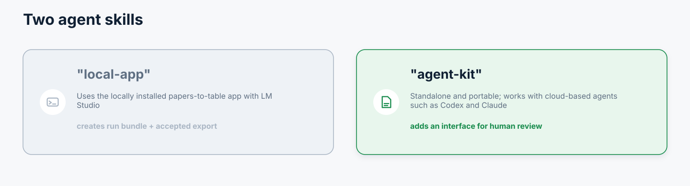
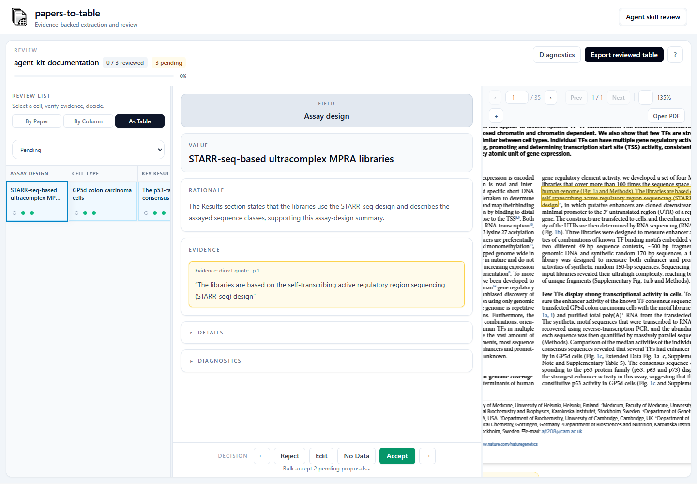

# Papers-To-Table Agent Kit

The **Agent Kit** turns a capable general-purpose agent such as Codex or Claude into an evidence-first paper-to-table assistant. It is standalone: you do not need to install the papers-to-table app, run LM Studio, or configure a local model.

Give the agent your PDFs, table, and field descriptions. It returns a filled CSV with source-linked evidence and can launch a browser workspace where you inspect each proposed value beside the relevant PDF passage before exporting reviewed results.



## Why Use It

- **Start with the agent you already use.** The skill works through the agent's own document-reading and reasoning capabilities.
- **Get a table, not a chat summary.** Results follow your rows and fields and are delivered as a reusable CSV.
- **Keep every value inspectable.** Proposals carry page-level evidence and a concise extraction rationale.
- **Review visually when it matters.** The optional browser interface keeps the proposed field, value, evidence, and source PDF together.
- **Stay portable.** The output package can travel with the project and does not depend on a running papers-to-table backend.
- **Preserve approved baselines.** Before extraction, the scaffold checks compatible companion CSV/XLSX tables for populated target values missing from the chosen template. Ambiguity fails closed; an approved source can be selected explicitly and is recorded with hashes in `baseline_manifest.json`.

It is especially useful for one-off literature tables, benchmark datasets, collaborative evidence gathering, and projects where a strong hosted agent is available but the local app is not installed.

## What Your Agent Will Do

1. Read the table structure and field descriptions before extracting values.
2. Match each paper to exactly one row using DOI, normalized title, authors, and year; ambiguous or duplicate matches stop rather than falling back silently to filename or row order.
3. Record the narrowest useful quotation, table passage, caption, or page context for each proposed value.
4. Validate the filled CSV, evidence records, and rationales before handing them over.
5. Clearly label the first CSV as agent-extracted and not yet human-reviewed.
6. Ask whether you want to inspect the results in the browser interface.
7. If you opt in, launch the review workspace and export a separate reviewed CSV from accepted decisions.

By default the kit fills blank cells only. It preserves existing values exactly and does not treat them as evidence or examples to copy. A full source table may contain rows without a supplied PDF; the matched subset is made explicit with `pdf_id`, while every supplied PDF must resolve to one row. When you explicitly ask it to verify existing values, populated cells become independently evidenced review proposals: the original value remains in the unreviewed filled CSV, the review interface shows the existing and proposed values, and only an accepted decision changes the reviewed CSV.

The authoring contract distinguishes direct extraction, calculations, figure estimates, protocol inference, and audited absence inference. Numeric and categorical fields are validated against the supplied schema. Calculated operands must describe compatible assay stages and units; figure estimates stay approximate and cite a rendered panel/caption; inferred absence is flagged for reviewer attention. The extraction workflow also checks that evidence belongs to the present study and reconciles design, delivery/integration, readout, barcode/UMI roles, scale, and construct count before handoff.

The procedural authoring, validation, and export rules live inside the skill. A human user does not need to prepare its internal JSON files or run its helper scripts manually.

## Browser Review

The review workspace lets you move through proposed cells, compare each value with its evidence, open the source PDF at the cited page, edit or reject a proposal, and export only accepted results. Ctrl/Command-click toggles individual proposal cells, Shift-click selects a queue range or table rectangle, and primary-button dragging selects a rectangle in table mode; a guarded selection bar applies Accept, Reject, or No data to pending proposals, with a separate checkbox required to replace reviewed decisions. The initial filled CSV remains separate, so review never silently overwrites the source table.



## Installation

Tell your agent:

```text
Install the papers-to-table Agent Kit from https://github.com/jjfroehlich/papers-to-table/tree/main/skills/papers-to-table-agent-kit/
```

Alternatively, copy the complete `skills/papers-to-table-agent-kit/` directory into your agent system's skill directory. Keep its `assets/`, `references/`, `scripts/`, and `templates/` directories together.

Then ask naturally, for example:

```text
Use the papers-to-table Agent Kit to fill this literature table from these PDFs. Preserve evidence for every proposed value.
```

## When To Choose The Local App Instead

Choose the [Local App skill](papers-to-table-local-app.md) when you want the agent to operate an installed papers-to-table pipeline, keep model inference local through LM Studio, process repeatable batches with one configuration, or produce the main app's full diagnostic run bundle.

## Trust Boundary

The kit makes extraction auditable; it does not make every extracted value correct or prove that a paper's claim is scientifically sound. Review important results, especially inferred values and fields without direct quotations. A reviewed CSV contains accepted decisions; an agent-extracted CSV does not imply human validation.

## Benchmark Note

Codex with GPT-5.5 xhigh produced similar content-correctness score distributions with its default workflow and with the Agent Kit. So the enforced structured workflow of the skill does not seem to reduce extraction quality compared to the native agent.


*Three replicates across 15 papers and 31 target columns in optimizer run `20260615_004637_compare_models`; see [Benchmark Datasets](benchmark-datasets.md) for interpretation limits.*
