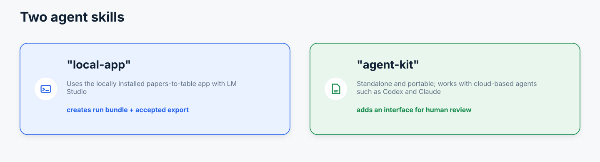
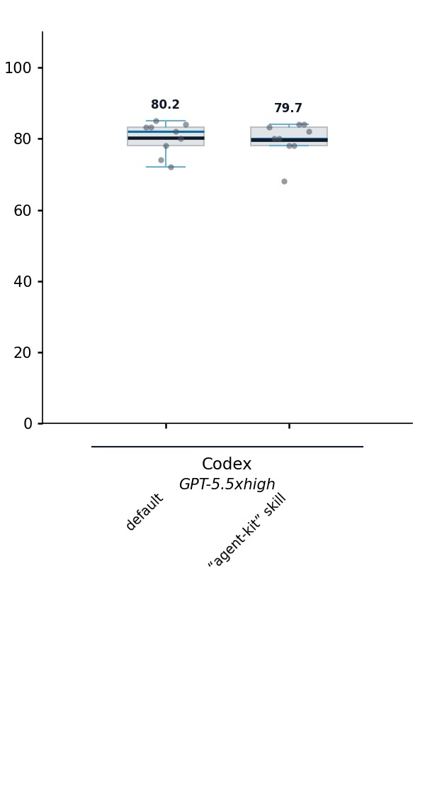

# Papers-To-Table Agent Kit

`skills/papers-to-table-agent-kit/` is a standalone skill for agents that extract reported information from research publications, scientific PDFs, and technical documents into source-linked tables. Target fields can include technical parameters, descriptions of results, or claims made in a publication. The kit standardizes review of where extracted information came from; it does not evaluate whether publication claims are scientifically supported or true.



The kit gives light extraction guidance and standardizes the handoff from agent extraction to human review: agents provide `review_input.json`, PDFs, and optional table/schema inputs; kit scripts generate the local review UI, normalized artifacts, an unreviewed draft filled table, decisions, audit logs, accepted-only exports, and a cleaned reviewed bundle.

For document-to-table extraction, the default deliverable is the formal review package, not only `_filled.csv` outputs. Draft filled CSVs are allowed as secondary convenience files, but `_filled.csv` alone is incomplete unless the user explicitly requested CSV-only extraction. When a research report or synthesis benefits from it, accepted values can also be rendered as a concise summarizing table in addition to CSV outputs.

Using the agent-kit skill did not degrade performance in this benchmark: Codex with GPT-5.5 xhigh produced closely overlapping score distributions with its default extraction workflow and with the skill.



*Content-correctness [Eval scores](eval.md) from three replicates across 15 papers and 31 target columns in optimizer run `20260615_004637_compare_models`. Numbers above the boxes give mean scores to one decimal percentage point. The observed similarity is specific to this benchmark and configuration, rather than a guarantee for other tasks or agent versions.*

## Input Layout

External agents author only:

```text
RUN_DIR/
  review_input.json
  pdfs/
  source_table.csv  # optional
  schema.json       # optional
```

The generated directories are script-owned. Do not hand-author `normalized/`, `summaries/`, `exports/`, or compatibility artifacts.

## Review Input

`review_input.json` uses schema version `papers_to_table.review_input.v1`.

Minimal example:

```json
{
  "schema_version": "papers_to_table.review_input.v1",
  "run_id": "agent_review_001",
  "pdfs": [
    {"pdf_id": "paper_a", "path": "pdfs/paper_a.pdf", "label": "Paper A"}
  ],
  "columns": [
    {"column_name": "Finding", "description": "Main reported finding", "field_type": "text"}
  ],
  "rows": [
    {"row_id": "row_1", "pdf_id": "paper_a", "values": {"Title": "Paper A"}}
  ],
  "proposals": [
    {
      "row_id": "row_1",
      "column_name": "Finding",
      "proposed_value": "Example value",
      "evidence": [
        {
          "pdf_id": "paper_a",
          "source_type": "direct_quote",
          "page_number": 3,
          "quote_text": "Exact supporting sentence from the PDF."
        }
      ]
    }
  ]
}
```

`proposal_id`, `evidence_id`, `cell_id`, and `created_at` are optional. The builder generates deterministic IDs when they are absent and validates uniqueness when they are supplied.

Every non-empty proposed value needs at least one structured evidence record. Quote, table, caption, evidence text, bbox regions, or figure-caption evidence produce stronger labels; page-plus-reasoning evidence is allowed but is visibly marked weak/attention in the review UI. These labels describe reviewability and source linkage, not whether a scientific claim is correct or externally supported.

Generated evidence keeps `evidence_schema_version="main_evidence"` and normalizes `source_type` to a stable review/export vocabulary. If the authored evidence used kit-specific text kinds such as `table_text`, `caption_text`, or `evidence_text`, the original kind is preserved in `authored_evidence_kind`.

Highlight regions must use finite numeric coordinates, a positive page reference, and nonzero area. Normalized coordinates must stay within `[0, 1]`; validation also warns when coordinate conventions look ambiguous.

## Build And Review

Default one-step workflow:

```bash
python skills/papers-to-table-agent-kit/scripts/build_and_serve_review.py --run RUN_DIR
```

This validates the agent-authored inputs, builds the static review bundle, validates generated artifacts, starts the localhost review UI, and prints `review_url`.

For tests or non-interactive agents:

```bash
python skills/papers-to-table-agent-kit/scripts/build_and_serve_review.py --run RUN_DIR --build-only --json
```

Equivalent explicit steps:

```bash
python skills/papers-to-table-agent-kit/scripts/validate_review_package.py --run RUN_DIR --mode authoring
python skills/papers-to-table-agent-kit/scripts/build_review_package.py --run RUN_DIR
python skills/papers-to-table-agent-kit/scripts/serve_review.py --run RUN_DIR
```

The server prints and opens a `http://127.0.0.1:.../review/index.html` URL. Localhost mode supports decision writeback and accepted-only export. The review header visibly distinguishes browser-only saves, confirmed server writeback, and server writeback failures. Opening `RUN_DIR/review/index.html` directly can work as download-only mode when the browser allows local PDF access.

If the review UI cannot be kept running, report the exact wrapper or `serve_review.py` command so the user can start it.

## Generated Artifacts

`build_review_package.py` writes:

```text
review/
  index.html
  assets/*
  review_package.json
normalized/
  proposals.jsonl
  evidence.jsonl
summaries/
  validation_report.json
exports/
  draft_filled_table.csv
```

`exports/draft_filled_table.csv` is an unreviewed agent draft produced from proposed values so there is a usable table before review. It is not a human-reviewed output.

After review/export, the kit writes:

```text
review/decisions.jsonl
exports/final_table.csv
exports/audit_log_*.json
exports/diagnostics_*.json
exports/reviewed_bundle/
  filled_table_reviewed.csv
  manifest.json
  review/
    decisions.jsonl
    proposals.jsonl
    evidence.jsonl
  audit/
    audit_log_*.json
    diagnostics_*.json
    reviewer_summary.json
    validation_report.json
summaries/reviewer_summary.json
```

`exports/final_table.csv` includes only accepted and accepted-with-edit values. Rejected, pending, and confirmed-no-data proposals are preserved in audit artifacts but are not exported as filled values.

`exports/reviewed_bundle/` is the cleaned folder for downstream use. It excludes copied PDFs, source tables, schemas, PDF.js assets, and review HTML.

## Applying Decisions

If decisions were downloaded from the browser, apply them with:

```bash
python skills/papers-to-table-agent-kit/scripts/apply_review_decisions.py --run RUN_DIR --decisions RUN_DIR/review/downloaded_decisions.json
```

If `serve_review.py` wrote `review/decisions.jsonl`, export with:

```bash
python skills/papers-to-table-agent-kit/scripts/apply_review_decisions.py --run RUN_DIR --use-existing-decisions
```

For trusted automation, the kit can explicitly auto-accept all proposals:

```bash
python skills/papers-to-table-agent-kit/scripts/apply_review_decisions.py --run RUN_DIR --accept-all
```

Auto-accepted decisions are recorded with `decision_source="automation_accept_all"`.

## Installation

Install by telling your agent to use `https://github.com/jjfroehlich/papers-to-table/tree/main/skills/papers-to-table-agent-kit/`, or copy `skills/papers-to-table-agent-kit/` into the agent system's skill directory. Keep `assets/`, `references/`, `scripts/`, and `templates/` with it so the bundled PDF.js viewer remains portable and quote highlighting works in the default workflow.

Use `templates/extraction_to_review_prompt.md` as the reusable external-agent prompt when the agent should extract values and produce the review package in one pass.
