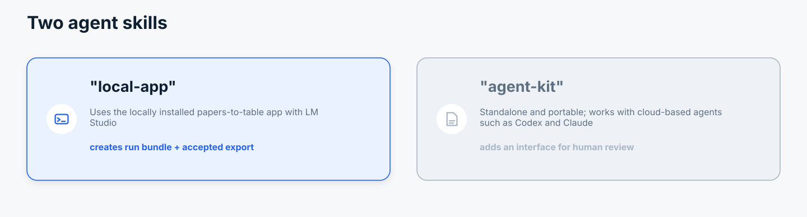

# Papers-To-Table Local App Skill

The **Local App** skill lets an agent operate an installed papers-to-table pipeline for you. It combines the app's repeatable extraction workflow and diagnostics with a local LLM provider, normally LM Studio.

Choose it when privacy, reproducibility, batch processing, and standard run artifacts matter more than the convenience of letting a hosted agent perform the extraction itself.



## Why Use It

- **Keep inference local.** PDFs and prompts can stay on your machine when you use a local LM Studio model.
- **Reuse a controlled pipeline.** The same configuration, schema, matching logic, and extraction stages can be applied across papers and reruns.
- **Scale beyond an interactive chat.** The agent can launch long-running or batch jobs through the app's headless workflow.
- **Get full diagnostics.** Standard run bundles preserve matching outcomes, proposals, evidence, warnings, decisions, and export records.
- **Let the agent handle the mechanics.** It checks readiness, runs extraction, inspects problems, and reports the output rather than merely giving you commands.

## Good Use Cases

- Private or unpublished PDFs that should be processed with a local model.
- Repeatable extraction from one spreadsheet, schema, and PDF collection.
- Larger unattended jobs where a persistent run bundle and diagnostics matter.
- Experiments comparing local models, prompts, or extraction settings.

## Installation

First install the [papers-to-table app](../getting-started/installation.md) and configure [LM Studio](../getting-started/lm-studio.md). Then tell your agent:

```text
Install the papers-to-table Local App skill from https://github.com/jjfroehlich/papers-to-table/tree/main/skills/papers-to-table-local-app/
```

Alternatively, copy `skills/papers-to-table-local-app/` into the agent system's skill directory and keep its `references/` files with it.

## What Your Agent Will Do

1. Confirm that the app, inputs, configuration, and local model are ready.
2. Inspect field descriptions because they become extraction instructions.
3. Run preflight and stop on a real readiness problem instead of silently degrading.
4. Launch the headless extraction workflow and monitor it to completion.
5. Inspect matching outcomes, evidence quality, missing values, provider warnings, and export diagnostics.
6. Report the exported table, run bundle, acceptance mode, important caveats, and recommended next step.

The skill normally uses the app's headless command surface. You do not need to remember the command or inspect every artifact yourself.

## What You Get

- A new exported table rather than an overwritten source file.
- A standard run bundle containing proposals, evidence, summaries, and diagnostics.
- Clear reporting of unmatched papers, uncertain fields, degraded provider behavior, and whether values were automatically accepted.
- Artifacts that can be reopened in the main browser app when human review is needed.

## When To Choose The Agent Kit Instead

Choose the standalone [Agent Kit](papers-to-table-agent-kit.md) when the local app or LM Studio is not installed, when you want Codex or Claude to use its own extraction capabilities, or when you want a lightweight evidence-backed CSV plus optional browser review without running the full backend pipeline.

## Important Boundaries

- This skill requires an installed papers-to-table app and a ready provider.
- Auto-accepted values are not human-reviewed.
- Provider-readiness failures are blockers, not harmless warnings.
- Evidence makes results auditable but does not guarantee scientific correctness.
- Papers-to-table is experimental; inspect important outputs before relying on them.
